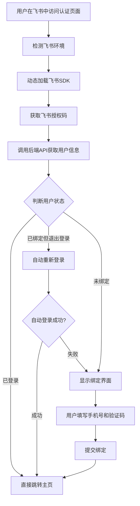
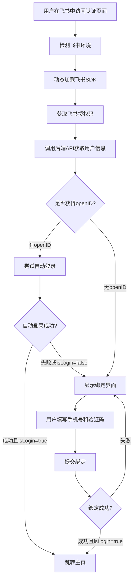
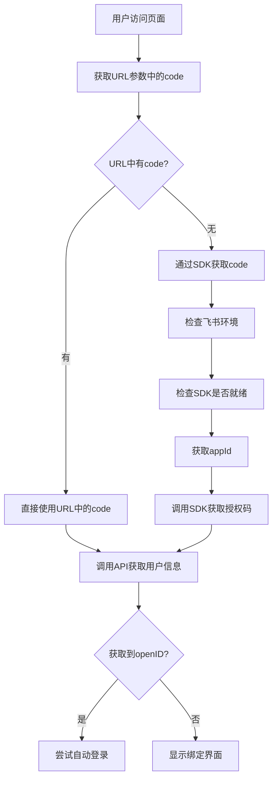

# 飞书免登录流程纠错文档

## 📋 概述

本文档对比分析了之前理解的飞书登录流程与实际代码实现的差异，纠正了流程理解中的错误。

**文件位置**: `client/src/pages/feishu/auth.vue`  
**分析时间**: 2025-01-12  
**版本**: 纠错版

---

## ❌ 之前流程图的错误分析

### 原始流程图（错误版本）


### 🔴 主要错误点

#### 1. **"已登录"状态判断不存在**
**错误理解**: 认为系统会判断用户是否已经登录
```javascript
// ❌ 实际代码中没有这样的逻辑
if (用户已登录) {
  直接跳转主页;
}
```

**实际代码逻辑**:
```javascript
// ✅ 只是基于openID的存在与否
if (this.openID) {
  // 有openID就尝试自动登录，不管之前状态
  await this.attemptAutoLogin();
} else {
  // 无openID就显示绑定界面
  this.authState = AUTH_STATES.NEED_BINDING;
}
```

#### 2. **"已绑定但退出登录"概念错误**
**错误理解**: 认为系统会区分"已绑定但退出登录"的状态

**实际逻辑**: 代码中不存在这种复杂的状态判断
```javascript
// attemptLogin() 函数的实际逻辑
async attemptLogin() {      
  if (this.openID) {
    // 有openID就尝试自动登录（不管是否有userPin，不管之前是否退出）
    this.loadingText = '检测到飞书身份，正在自动登录...';
    await this.attemptAutoLogin();
  } else {
    this.authState = AUTH_STATES.NEED_BINDING;
  }
}
```

#### 3. **缺少关键的授权码获取分支**
**缺失内容**:
- URL参数获取code vs SDK获取code的分支选择
- SDK获取时需要先获取appId的步骤
- 环境检测和SDK就绪检查

---

## ✅ 正确的流程图

### 修正后的简化流程


### 详细的授权码获取分支


---

## 🔍 核心逻辑对比

### 错误理解 vs 实际逻辑

| 维度 | 错误理解 | 实际代码逻辑 |
|------|----------|--------------|
| **状态判断** | 已登录/已绑定但退出/未绑定 | 只判断：是否有openID |
| **已登录处理** | 直接跳转主页 | 不存在这种判断 |
| **已绑定处理** | 区分是否退出登录 | 有openID就尝试登录，不区分历史状态 |
| **核心分支** | 三种用户状态 | 两种情况：有/无openID |
| **复杂度** | 看起来很复杂 | 实际逻辑相对简单 |

### 实际的业务逻辑
```javascript
// 核心判断逻辑（简化版）
async attemptLogin() {
  if (this.openID) {
    // 情况1：有openID，尝试自动登录
    const result = await 自动登录API(openID);
    if (result.isLogin) {
      跳转首页();
    } else {
      显示绑定界面();
    }
  } else {
    // 情况2：无openID，显示绑定界面
    显示绑定界面();
  }
}
```

---

## 📊 流程简化总结

### 🎯 实际的核心流程（4步）
1. **获取openID** - 通过飞书授权码换取用户标识
2. **检查openID** - 判断是否获取到有效的openID
3. **尝试登录** - 有openID就调用自动登录API
4. **处理结果** - 成功跳转，失败显示绑定界面

### 💡 关键代码位置
```javascript
// 1. 获取openID
async getOpenID() {
  // 通过授权码调用API获取openID
}

// 2. 判断是否有openID
async attemptLogin() {
  if (this.openID) {
    await this.attemptAutoLogin(); // 尝试登录
  } else {
    this.authState = AUTH_STATES.NEED_BINDING; // 显示绑定
  }
}

// 3. 自动登录
async attemptAutoLogin() {
  const result = await util.request({
    url: '/api/user/fsreglogin',
    data: { openID: this.openID }
  });
  
  if (result?.data?.isLogin) {
    // 登录成功，跳转
    window.location.href = '/';
  } else {
    // 登录失败，显示绑定界面
    this.authState = AUTH_STATES.NEED_BINDING;
  }
}
```

---

## 🚨 常见误解澄清

### 误解1：系统会记住用户登录状态
**❌ 错误**: 认为系统会检查用户是否已经登录  
**✅ 正确**: 每次都需要通过openID尝试登录，没有持久的登录状态检查

### 误解2：已绑定用户有特殊处理
**❌ 错误**: 认为已绑定但退出的用户有特殊的重新登录流程  
**✅ 正确**: 所有有openID的用户都走相同的自动登录流程

### 误解3：流程很复杂
**❌ 错误**: 认为有多种用户状态需要分别处理  
**✅ 正确**: 只有两个主要分支：有openID尝试登录，无openID显示绑定

---

## 📈 理解纠正的价值

### 对开发的帮助
1. **简化调试**: 理解真实的分支逻辑，减少调试时间
2. **准确修改**: 知道实际的判断条件，避免错误的代码修改
3. **性能优化**: 明确真实的执行路径，针对性优化

### 对维护的帮助
1. **减少困惑**: 避免基于错误理解进行代码修改
2. **准确文档**: 为团队提供准确的技术文档
3. **有效沟通**: 与产品、测试团队准确沟通业务逻辑

---

## 🔚 结论

飞书免登录的实际逻辑比最初理解的要简单：

**核心就是基于openID的二分法判断**：
- **有openID** → 尝试自动登录 → 成功跳转/失败绑定  
- **无openID** → 直接显示绑定界面

没有复杂的用户状态判断，没有"已登录"的概念检查，也不区分"已绑定但退出"的特殊情况。

理解准确的业务逻辑对代码维护和功能扩展都非常重要。