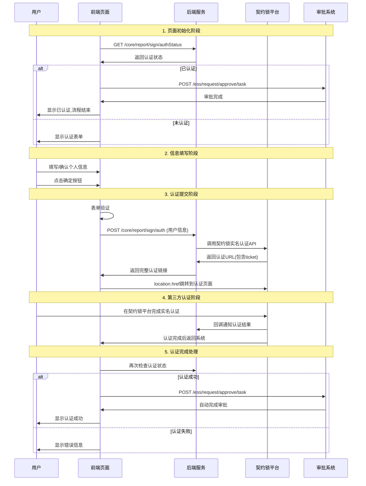

# 人员认证系统完整技术文档

## 1. 系统概览

### 1.1 系统架构
```
┌─────────────────────────────────────────────────────────────┐
│                     人员认证系统架构                          │
├─────────────────┬─────────────────┬─────────────────────────┤
│   前端组件层     │    后端服务层     │      第三方服务层         │
│                │                │                         │
│ Sign/index.vue  │                │                         │
│ ├── SignHeader  │  /core/report  │    契约锁认证平台         │
│ ├── Personnel   │  /sign/auth    │                         │
│ │   Attest      │                │ auth.qiyuesuo.cn        │
│ └── Message     │  /ess/request  │                         │
│                │  /approve/task │                         │
└─────────────────┴─────────────────┴─────────────────────────┘
```

### 1.2 核心文件结构
```
src/
├── views/Sign/
│   ├── index.vue                     # 主容器组件
│   └── PersonnelAttest/
│       └── personnelAttest.vue       # 人员认证核心组件
├── api/
│   ├── sign/index.js                 # 认证相关API
│   └── MyAgent/myAgent.js            # 审批相关API
└── store/
    └── user.js                       # 用户状态管理
```

## 2. 完整业务流程

### 2.1 流程时序图


### 2.2 详细步骤说明

#### 步骤1: 页面初始化检查
**触发时机**: 组件created生命周期
```javascript
// personnelAttest.vue:182-200
async created() {
  const res = await authStatus();  // 检查认证状态
  if (res && res.data) {
    this.current = 4;  // 已认证状态
    // 自动处理审批流程
    processApproval([{
      request_id: this.$route.query.requestId,
      approved: true,
      opinion: '',
    }]).then(res => {
      this.$router.go(-1);  // 返回上一页
      this.$Message.success({
        duration: 5,
        content: this.$t('new322'),  // 显示成功消息
      });
    });
  }
}
```

**API调用**: `GET /core/report/sign/authStatus`
- **功能**: 检查用户当前认证状态
- **返回**: 认证状态信息
- **处理逻辑**: 如已认证则直接完成审批流程

#### 步骤2: 用户信息填写界面
**界面状态**: `current = 0`
**表单字段配置**:
```javascript
// 表单数据结构
form: {
  name: this.$store.state.user.userInfo.emp_name,      // 姓名(只读)
  idNo: this.$store.state.user.userInfo.identity_id,   // 身份证(禁用)
  mobileNo: this.$store.state.user.userInfo.mobile,    // 手机号(可编辑)
  bankCardNo: '',                                      // 银行卡号(四要素时)
  type: ''                                            // 认证类型(自动设置)
}
```

**表单验证规则**:
```javascript
ruleInline: {
  name: [{ 
    required: true, 
    message: this.$t('placeholder09'), 
    trigger: 'blur' 
  }],
  idNo: [{ 
    required: true, 
    message: this.$t('placeholder22'), 
    trigger: 'blur',
    ...this.$rules.cardId2  // 身份证格式验证
  }],
  mobileNo: [
    { required: true, message: this.$t('placeholder30') },
    { ...this.$rules.phoneNum11, trigger: 'blur' }  // 手机号格式验证
  ],
  bankCardNo: [{ 
    required: true, 
    message: this.$t('placeholder34'), 
    trigger: 'blur' 
  }]
}
```

#### 步骤3: 认证提交核心逻辑
**关键方法**: `submitForm()` (personnelAttest.vue:203-225)

```javascript
async submitForm() {
  this.$refs.form.validate(async valid => {
    if (valid) {
      this.loading = true;  // 开启加载状态
      
      // 设置认证类型
      this.form.type = this.attestType;
      
      // 调用后端认证接口
      res = await personnelSign(this.form);
      
      if (res && res.data) {
        this.current = 1;  // 更新步骤状态
        // 关键: 直接跳转到第三方认证平台
        location.href = res.data;  // res.data包含完整的认证URL+ticket
      }
    }
  });
}
```

#### 步骤4: Ticket获取机制详解

**前端API调用**:
```javascript
// /src/api/sign/index.js:5-9
personnelSign: data =>
  request('/core/report/sign/auth', {
    method: 'post',
    body: data,  // 用户表单数据
  })
```

**请求数据格式**:
```json
{
  "name": "张三",
  "idNo": "11010119900101001X", 
  "mobileNo": "13800138000",
  "bankCardNo": "6225882345678901234",  // 可选
  "type": "四要素认证"
}
```

**后端处理流程**:
1. **数据接收**: 后端接收用户基本信息
2. **参数构建**: 将用户信息转换为契约锁API所需格式
3. **契约锁调用**: 调用契约锁实名认证接口
4. **Ticket生成**: 契约锁生成加密ticket参数
5. **URL构建**: 拼接完整的认证跳转链接
6. **响应返回**: 返回包含ticket的完整URL

**响应数据格式**:
```json
{
  "data": "https://auth.qiyuesuo.cn/?ticket=QYZxsuukUonV7DAVvDyYdtyIafLb%2B%2BfmH00xtElxvaFAvq9oFMZbE8MPPc5FhPlq&channel=OPEN_V2",
  "message": "success",
  "code": 200
}
```

#### 步骤5: Ticket参数分析

**Ticket特性**:
- **加密性**: Base64编码的加密字符串
- **时效性**: 通常5-15分钟有效期
- **唯一性**: 每次请求生成不同的ticket
- **包含信息**: 用户身份信息、认证类型、时间戳等

**URL编码处理**:
```
原始ticket: QYZxsuukUonV7DAVvDyYdtyIafLb++fmH00xtElxvaFAvq9oFMZbE8MPPc5FhPlq
URL编码:    QYZxsuukUonV7DAVvDyYdtyIafLb%2B%2BfmH00xtElxvaFAvq9oFMZbE8MPPc5FhPlq
```

#### 步骤6: 第三方认证完成
**认证过程**:
1. 用户在契约锁平台完成人脸识别/身份验证
2. 契约锁验证身份信息真实性
3. 认证完成后回调通知后端服务
4. 用户自动返回到原系统

## 3. 技术实现细节

### 3.1 前端状态管理
```javascript
data() {
  return {
    current: 0,        // 当前步骤: 0=填写, 1=验证, 3=完成
    loading: false,    // 加载状态
    form: {...},       // 表单数据
    stepListFour: [    // 步骤显示
      { id: 1, value: this.$t('table208') },  // 实名认证
      { id: 4, value: this.$t('table211') }   // 认证完成
    ]
  }
}
```

### 3.2 API接口完整定义

**认证相关接口**:
```javascript
export default {
  // 个人认证--契约锁 (当前使用)
  personnelSign: data => request('/core/report/sign/auth', {
    method: 'post', body: data
  }),
  
  // 认证状态检查
  authStatus: data => request('/core/report/sign/authStatus', {
    method: 'get', body: data
  }),
  
  // 历史接口(已废弃)
  personnelThreeAttest: data => request('/esign/auth/personal/individual/telecom3Factors', {
    method: 'post', body: data
  }),
  personnelFourAttest: data => request('/esign/auth/personal/individual/bankCard4Factors', {
    method: 'post', body: data
  })
}
```

**审批相关接口**:
```javascript
// /src/api/MyAgent/myAgent.js
export default {
  processApproval: data => request('/ess/request/approve/task', {
    method: 'post', body: data
  })
}
```

### 3.3 错误处理机制

**前端错误处理**:
```javascript
// 表单验证失败
this.$refs.form.validate(async valid => {
  if (!valid) {
    this.$Message.error('请检查表单信息');
    return;
  }
  // 继续处理...
});

// API调用失败
try {
  const res = await personnelSign(this.form);
  if (!res || !res.data) {
    this.$Message.error('认证服务暂时不可用');
    return;
  }
} catch (error) {
  this.$Message.error('网络错误，请稍后重试');
  this.loading = false;
}
```

## 4. 安全机制

### 4.1 数据安全
- **敏感信息加密**: 身份证号、银行卡号在传输过程中加密
- **HTTPS通信**: 所有API调用使用HTTPS协议
- **Token验证**: 用户身份通过JWT Token验证

### 4.2 认证安全
- **第三方平台**: 使用契约锁等权威认证平台
- **实人认证**: 通过人脸识别等生物特征验证
- **防重放攻击**: Ticket具有时效性，防止重复使用

### 4.3 业务安全
- **状态检查**: 多次验证认证状态，避免重复认证
- **审批自动化**: 认证成功后自动完成审批，减少人工干预
- **异常处理**: 完善的错误处理和回滚机制

## 5. 业务特点与优势

### 5.1 用户体验优化
- **信息预填**: 从用户store自动获取基本信息
- **一键认证**: 简化认证流程，减少用户操作
- **状态反馈**: 清晰的步骤显示和加载状态
- **自动跳转**: 无感知的页面跳转体验

### 5.2 技术架构优势
- **解耦设计**: 前后端分离，第三方服务独立
- **统一认证**: 简化多种认证方式为单一流程
- **自动化处理**: 减少人工干预，提高效率
- **可扩展性**: 易于集成其他第三方认证平台

### 5.3 维护性优势
- **代码复用**: 统一的API调用方式
- **配置化**: 认证类型通过配置灵活调整
- **监控友好**: 完善的日志和状态追踪
- **测试友好**: 清晰的状态机便于单元测试

## 6. 部署与运维

### 6.1 环境配置
```javascript
// 环境变量配置示例
const config = {
  // 契约锁配置
  qiyuesuo: {
    baseUrl: 'https://auth.qiyuesuo.cn',
    appId: 'your_app_id',
    appSecret: 'your_app_secret'
  },
  // API端点配置
  apiEndpoints: {
    auth: '/core/report/sign/auth',
    authStatus: '/core/report/sign/authStatus',
    approval: '/ess/request/approve/task'
  }
}
```

### 6.2 监控指标
- **认证成功率**: 监控整体认证完成情况
- **API响应时间**: 监控接口性能
- **错误率统计**: 追踪各类异常情况
- **用户流失点**: 分析用户在哪个环节流失

## 7. 关键技术点总结

### 7.1 Ticket获取流程核心
1. **用户提交** → 前端表单验证通过后调用 `personnelSign` 接口
2. **后端处理** → 调用契约锁API生成认证会话
3. **Ticket生成** → 契约锁返回包含用户信息的加密ticket
4. **URL返回** → 后端返回完整的认证跳转链接
5. **页面跳转** → 前端直接跳转到第三方认证平台

### 7.2 关键代码位置
- **核心提交逻辑**: `personnelAttest.vue:203` - `submitForm()` 方法
- **API定义**: `src/api/sign/index.js:5` - `personnelSign` 接口
- **状态检查**: `personnelAttest.vue:182` - `created()` 生命周期
- **审批处理**: `src/api/MyAgent/myAgent.js:10` - `processApproval` 接口

### 7.3 数据流转关键节点
```
用户表单数据 → POST /core/report/sign/auth → 契约锁API → 生成ticket → 返回认证URL → 页面跳转
```

这份技术文档全面覆盖了人员认证系统的架构设计、业务流程、技术实现、安全机制等各个方面，特别详细说明了ticket参数的获取机制，可以作为开发、维护和培训的重要参考资料。