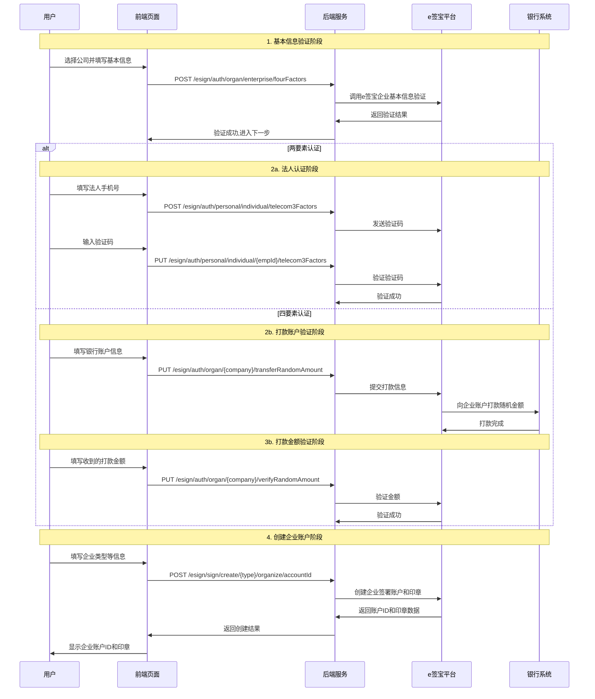

# 公司认证系统完整技术文档

## 1. 系统概览

### 1.1 系统架构
```
┌─────────────────────────────────────────────────────────────┐
│                     公司认证系统架构                          │
├─────────────────┬─────────────────┬─────────────────────────┤
│   前端组件层     │    后端服务层     │      第三方服务层         │
│                │                │                         │
│ CompanyAttest   │                │                         │
│ ├── 基本信息     │  /esign/auth/  │    e签宝认证平台          │
│ ├── 法人认证     │  organ/        │                         │
│ ├── 打款验证     │  enterprise/   │                         │
│ ├── 账户创建     │                │                         │
│ └── 结果显示     │  /esign/sign/  │                         │
│                │  create/       │                         │
└─────────────────┴─────────────────┴─────────────────────────┘
```

### 1.2 核心文件结构
```
src/
├── views/Sign/
│   ├── index.vue                     # 主容器组件
│   └── CompanyAttest/
│       └── companyAttest.vue         # 公司认证核心组件
├── api/
│   ├── sign/index.js                 # 认证相关API
│   └── Personnel/common.js           # 通用选项API
└── store/
    └── user.js                       # 用户状态管理
```

## 2. 业务流程详解

### 2.1 认证类型区分

**两要素认证流程** (label179):
```
步骤1: 基本信息验证 → 步骤2: 法人认证 → 步骤3: 创建账户 → 步骤4: 完成
```

**四要素认证流程** (label180):
```
步骤1: 基本信息验证 → 步骤2: 打款账户验证 → 步骤3: 打款金额验证 → 步骤4: 创建账户 → 步骤5: 完成
```

### 2.2 详细流程时序图



### 2.3 步骤详细分析

#### 步骤1: 基本信息验证 (current = 0)

**界面表单字段**:
```javascript
form: {
  company: '',         // 选择的公司ID
  name: '',           // 组织机构名称
  orgCode: '',        // 证件号
  legalRepName: '',   // 法人姓名
  legalRepIdNo: '',   // 法人证件号
  type: ''            // 认证类型
}
```

**核心方法**: `submitForm()` (companyAttest.vue:656-674)
```javascript
async submitForm(formName) {
  let valid = await this.formValidate(formName);
  if (valid) {
    this.form.type = this.attestType;
    const res = await companyFourAttest(this.form);  // 调用基本信息验证接口
    if (res) {
      this.current = 1;  // 进入下一步
      // 数据传递给后续表单
      this.amountForm.name = this.form.name;
      this.amountForm.orgCode = this.form.orgCode;
      this.legaPersonForm.name = this.form.name;
      this.legaPersonForm.legalRepName = this.form.legalRepName;
      this.legaPersonForm.legalRepIdNo = this.form.legalRepIdNo;
    }
  }
}
```

**API调用**: 
- 接口: `POST /esign/auth/organ/enterprise/fourFactors`
- 功能: 验证企业基本信息
- 参数: 公司信息、法人信息等

#### 步骤2a: 法人认证 (两要素认证, current = 1)

**法人认证表单**:
```javascript
legaPersonForm: {
  name: '',           // 组织机构名称(只读)
  legalRepName: '',   // 法人姓名(只读)
  legalRepIdNo: '',   // 法人证件号(只读)
  legaPhone: '',      // 法人手机号
  authcode: ''        // 验证码
}
```

**获取验证码方法**: `getCode()` (companyAttest.vue:675-688)
```javascript
async getCode(formName) {
  let valid = this.formValidate(formName);
  if (valid) {
    const res = await api.personnelThreeAttest({
      idNo: this.legaPersonForm.legalRepIdNo,
      mobileNo: this.legaPersonForm.legaPhone,
      name: this.legaPersonForm.legalRepName,
      type: this.$t('label176'),  // 三要素认证
    });
    if (res) {
      this.countDown(60);  // 开始60秒倒计时
    }
  }
}
```

**验证码验证方法**: `legaPersonSubmit()` (companyAttest.vue:690-706)
```javascript
async legaPersonSubmit() {
  if (this.legaPersonForm.authcode) {
    const obj = {
      empId: this.$store.state.user.userInfo.emp_id,
      code: { authcode: this.legaPersonForm.authcode },
    };
    const res = await api.perVerifyPhoneCode3(obj);
    if (res) {
      this.amountForm.phoneNumber = this.legaPersonForm.legaPhone;
      this.amountForm.phoneDisabled = true;
      this.current = 2;  // 跳到创建账户步骤
    }
  }
}
```

#### 步骤2b: 打款账户验证 (四要素认证, current = 1)

**打款验证表单**:
```javascript
paymentForm: {
  cardNo: '',         // 银行卡号
  brankIndex: '',     // 支行索引
  province: '',       // 省份(只读)
  city: '',          // 城市(只读)
  cnapsCode: '',     // 联行号
  bank: '',          // 银行
  subbranch: ''      // 支行全称
}
```

**银行信息搜索**: `remoteMethod()` (companyAttest.vue:599-611)
```javascript
async remoteMethod(val) {
  if (val) {
    this.searchLoading = true;
    const res = await searchBankInfo(this.companyId, { keyWord: val });
    if (res) {
      this.bankInfoOptions = res.data.list;
      this.$refs.subbranch.filterQueryChange = false;
      this.searchLoading = false;
    }
  }
}
```

**提交打款信息**: `paymentSubmit()` (companyAttest.vue:720-728)
```javascript
async paymentSubmit(formName) {
  let valid = this.formValidate(formName);
  if (valid) {
    const res = await paymentVerify(this.paymentForm, this.companyId);
    if (res) {
      this.current = 2;  // 进入金额验证步骤
    }
  }
}
```

#### 步骤3b: 打款金额验证 (四要素认证, current = 2)

**金额验证表单**:
```javascript
moneyForm: {
  amount: ''  // 收到的打款金额
}
```

**金额验证方法**: `verMoneyAmount()` (companyAttest.vue:730-738)
```javascript
async verMoneyAmount(formName) {
  let valid = this.formValidate(formName);
  if (valid) {
    const res = await verMoneyAmount(this.moneyForm, this.companyId);
    if (res) {
      this.current = 3;  // 进入创建账户步骤
    }
  }
}
```

#### 步骤4: 创建企业签署账户

**账户创建表单**:
```javascript
amountForm: {
  name: '',           // 组织机构名称(只读)
  orgCode: '',        // 证件号(只读)
  regType: '',        // 企业注册类型
  organType: '',      // 单位类型
  phoneNumber: '',    // 电话
  phoneDisabled: false // 是否禁用电话输入
}
```

**创建账户方法**: `creatCompanyAccountId()` (companyAttest.vue:740-763)
```javascript
async creatCompanyAccountId(formName) {
  let valid = this.formValidate(formName);
  if (valid) {
    const check = this.attestType === this.$t('label180');  // 是否四要素认证
    const res = await creatCompanyAccountAndSeal({
      ...this.amountForm,
      userType: 2,  // 法人注册
      company: this.companyId,
    }, 'check');
    
    if (res) {
      this.current = check ? 4 : 3;  // 设置完成状态
      this.accountId = res.data.accountId;  // 企业账户ID
      this.sealSrc = res.data.sealData;     // 企业印章数据
      this.$forceUpdate();
    }
  }
}
```

## 3. 技术实现细节

### 3.1 前端状态管理

**步骤控制逻辑**:
```javascript
// 根据认证类型显示不同的步骤
stepListFour: [        // 四要素认证步骤
  { id: 1, value: '基本信息验证' },
  { id: 2, value: '打款账户验证' },  
  { id: 3, value: '打款金额验证' },
  { id: 4, value: '创建账户' },
  { id: 5, value: '认证完成' }
],
stepListTwo: [         // 两要素认证步骤
  { id: 1, value: '基本信息验证' },
  { id: 2, value: '法人认证' },
  { id: 3, value: '创建账户' },
  { id: 4, value: '认证完成' }
]
```

**表单显示控制**:
```javascript
// 基本信息表单
v-if="current === 0"

// 法人认证表单 (仅两要素认证)
v-if="attestType === $t('label179') && current === 1"

// 打款账户验证表单 (仅四要素认证)
v-if="current === 1 && attestType === $t('label180')"

// 打款金额验证表单 (仅四要素认证)
v-if="current === 2 && attestType === $t('label180')"

// 创建账户表单
v-if="(attestType === $t('label179') && current === 2) || (attestType === $t('label180') && current === 3)"
```

### 3.2 API接口完整定义

**企业认证相关接口**:
```javascript
// 基本信息四要素认证
companyFourAttest: data => request('/esign/auth/organ/enterprise/fourFactors', {
  method: 'post', body: data
}),

// 基本信息两要素认证  
companyTwoAttest: data => request('/esign/auth/organ/enterprise/base', {
  method: 'post', body: data
}),

// 打款账户认证
paymentVerify: (data, company) => request(`/esign/auth/organ/${company}/transferRandomAmount`, {
  method: 'put', body: data
}),

// 打款金额验证
verMoneyAmount: (data, company) => request(`/esign/auth/organ/${company}/verifyRandomAmount`, {
  method: 'put', body: data
}),

// 创建企业签署账户及印章
creatCompanyAccountAndSeal: (data, type) => request(`/esign/sign/create/${type}/organize/accountId`, {
  method: 'post', body: data
}),

// 查询银行信息
searchBankInfo: (id, data) => request(`/esign/common/bank/message/${id}`, {
  params: data, method: 'get'
})
```

### 3.3 数据选项配置

**企业注册类型选项**:
```javascript
regTypeOptions: [
  { id: 11, value: '多证合一，传递社会信用代码号' },
  { id: 10, value: '组织机构代码号' },
  { id: 23, value: '企业工商注册码' }
]
```

**单位类型选项**:
```javascript
organTypeOptions: [
  { id: 0, value: '普通企业' },
  { id: 1, value: '社会团体' },
  { id: 2, value: '事业单位' },
  { id: 3, value: '民办非企业单位' },
  { id: 4, value: '党政及国家机构' }
]
```

### 3.4 表单验证规则

**关键字段验证**:
```javascript
ruleInline: {
  name: [{ required: true, message: '请输入组织机构名称', trigger: 'blur' }],
  orgCode: [{ required: true, message: '请输入证件号', trigger: 'blur' }],
  legalRepName: [{ required: true, message: '请输入法人姓名', trigger: 'blur' }],
  legalRepIdNo: [{ required: true, message: '请输入法人证件号', trigger: 'blur' }],
  legaPhone: [{ required: true, message: '请输入手机号', trigger: 'blur' }],
  cardNo: [{ required: true, message: '请输入卡号', trigger: 'blur' }],
  brankIndex: [{ required: true, type: 'number', message: '请输入支行名称', trigger: 'blur' }],
  amount: [{ required: true, message: '请输入收到的金额', trigger: 'blur' }],
  regType: [{ required: true, type: 'number', message: '请选择企业注册类型', trigger: 'blur' }],
  organType: [{ required: true, type: 'number', message: '请选择单位类型', trigger: 'blur' }]
}
```

## 4. 个人认证 vs 公司认证对比分析

### 4.1 流程复杂度对比

| 对比项 | 个人认证 | 公司认证 |
|--------|----------|----------|
| **步骤数量** | 2步 (信息填写→第三方认证) | 4-5步 (基本信息→专项认证→账户创建→完成) |
| **认证方式** | 统一契约锁认证 | 两要素/四要素认证可选 |
| **验证内容** | 个人身份信息 | 企业信息+法人信息+银行信息 |
| **第三方集成** | 契约锁 | e签宝 |

### 4.2 技术实现差异

| 技术点 | 个人认证 | 公司认证 |
|--------|----------|----------|
| **API接口数量** | 2个主要接口 | 6个主要接口 |
| **表单数量** | 1个主表单 | 4个分步表单 |
| **状态管理** | 简单状态机 | 复杂状态机 |
| **数据流转** | 直接跳转 | 多步数据传递 |

### 4.3 业务逻辑差异

**个人认证特点**:
- 流程简化，用户体验好
- 第三方平台统一处理
- 无需复杂的中间验证步骤
- 自动化程度高

**公司认证特点**:
- 流程严谨，安全性高
- 多重验证确保企业身份真实性
- 支持不同认证强度选择
- 需要人工参与更多环节

### 4.4 代码复杂度对比

```javascript
// 个人认证核心方法 (简单)
async submitForm() {
  // 1. 表单验证
  // 2. 调用API
  // 3. 页面跳转
  location.href = res.data;
}

// 公司认证核心方法 (复杂)
async submitForm() {
  // 1. 表单验证
  // 2. 调用API
  // 3. 状态更新
  // 4. 数据传递
  // 5. 步骤控制
}
```

## 5. 个人认证可借鉴的设计模式

### 5.1 推荐借鉴的优秀设计

#### 1. 分步表单设计模式
```javascript
// 可借鉴：清晰的步骤控制逻辑
<CloudSteps :current="current">
  <CloudStep v-for="(item, index) in stepList" :title="item.value" :key="index"></CloudStep>
</CloudSteps>

// 不同步骤显示不同表单
<CloudForm v-if="current === 0" :model="basicForm">
<CloudForm v-if="current === 1" :model="verifyForm">
```

#### 2. 统一的表单验证方法
```javascript
// 可借鉴：封装通用验证方法
async formValidate(formName) {
  let valid = await this.$refs[formName].validate().catch(() => false);
  return valid;
}
```

#### 3. 数据选项的动态加载
```javascript
// 可借鉴：异步获取选项数据
async getOptions() {
  const res = await getOption.getCompanyList();
  this.companyOptions = res ? res.data : [];
}
```

#### 4. 倒计时功能的实现
```javascript
// 可借鉴：验证码倒计时逻辑
countDown(val) {
  this.btnTitle = '60s';
  let init = val;
  this.timeInt = setInterval(() => {
    init -= 1;
    this.btnTitle = `${init}s`;
    if (init === 0) {
      clearInterval(this.timeInt);
      this.btnTitle = this.$t('button30');
    }
  }, 1000);
}
```

### 5.2 不推荐借鉴的复杂设计

#### 1. 过多的表单状态管理
```javascript
// 不推荐：过于复杂的多表单状态
form: {},
paymentForm: {},
moneyForm: {},
amountForm: {},
legaPersonForm: {}
```

#### 2. 复杂的条件渲染逻辑
```javascript
// 不推荐：过于复杂的显示条件
v-if="(attestType === $t('label179') && current === 2) || (attestType === $t('label180') && current === 3)"
```

## 6. 个人认证优化建议

基于公司认证的设计分析，对个人认证的优化建议：

### 6.1 保持现有优势
- **简洁的流程**: 继续保持2步流程的简洁性
- **统一认证**: 保持契约锁统一认证的模式
- **自动化处理**: 继续保持自动审批的高效性

### 6.2 可以改进的地方

#### 1. 增加步骤指示器
```javascript
// 建议添加：清晰的步骤显示
stepList: [
  { id: 1, value: '信息确认' },
  { id: 2, value: '身份认证' },
  { id: 3, value: '认证完成' }
]
```

#### 2. 完善错误处理
```javascript
// 建议添加：更完善的错误处理
try {
  const res = await personnelSign(this.form);
  if (!res || !res.data) {
    this.$Message.error('认证服务暂时不可用，请稍后重试');
    return;
  }
} catch (error) {
  this.$Message.error('网络错误，请稍后重试');
  this.loading = false;
}
```

#### 3. 增加加载状态优化
```javascript
// 建议添加：更好的加载状态管理
this.loading = true;
try {
  // API调用
} finally {
  this.loading = false;
}
```

## 7. 总结

公司认证系统展现了一个完整的多步骤认证流程的设计模式，其严谨的业务逻辑和完善的技术实现为个人认证的后续优化提供了宝贵的参考。

**核心收获**:
1. **分步设计模式**: 清晰的步骤划分和状态管理
2. **表单验证策略**: 统一的验证方法和规则配置  
3. **API设计思路**: 职责明确的接口划分
4. **用户体验优化**: 倒计时、加载状态等细节处理

**应用建议**:
- 借鉴其分步设计的清晰性，但保持个人认证的简洁性
- 学习其错误处理和状态管理的完善性
- 参考其表单验证和用户交互的友好性
- 避免过度复杂化，保持个人认证的高效特色

<function_calls>
<invoke name="TodoWrite">
<parameter name="todos">[{"id": "1", "content": "\u5206\u6790\u516c\u53f8\u8ba4\u8bc1\u9875\u9762\u7684\u5b8c\u6574\u4ee3\u7801\u7ed3\u6784", "status": "completed"}, {"id": "2", "content": "\u68b3\u7406\u516c\u53f8\u8ba4\u8bc1\u7684\u4e1a\u52a1\u6d41\u7a0b\u903b\u8f91", "status": "completed"}, {"id": "3", "content": "\u5206\u6790\u76f8\u5173API\u63a5\u53e3\u8c03\u7528\u5173\u7cfb", "status": "completed"}, {"id": "4", "content": "\u5bf9\u6bd4\u4e2a\u4eba\u8ba4\u8bc1\u548c\u516c\u53f8\u8ba4\u8bc1\u7684\u5dee\u5f02", "status": "completed"}, {"id": "5", "content": "\u8f93\u51fa\u8be6\u7ec6\u7684\u516c\u53f8\u8ba4\u8bc1\u6280\u672f\u6587\u6863", "status": "completed"}]