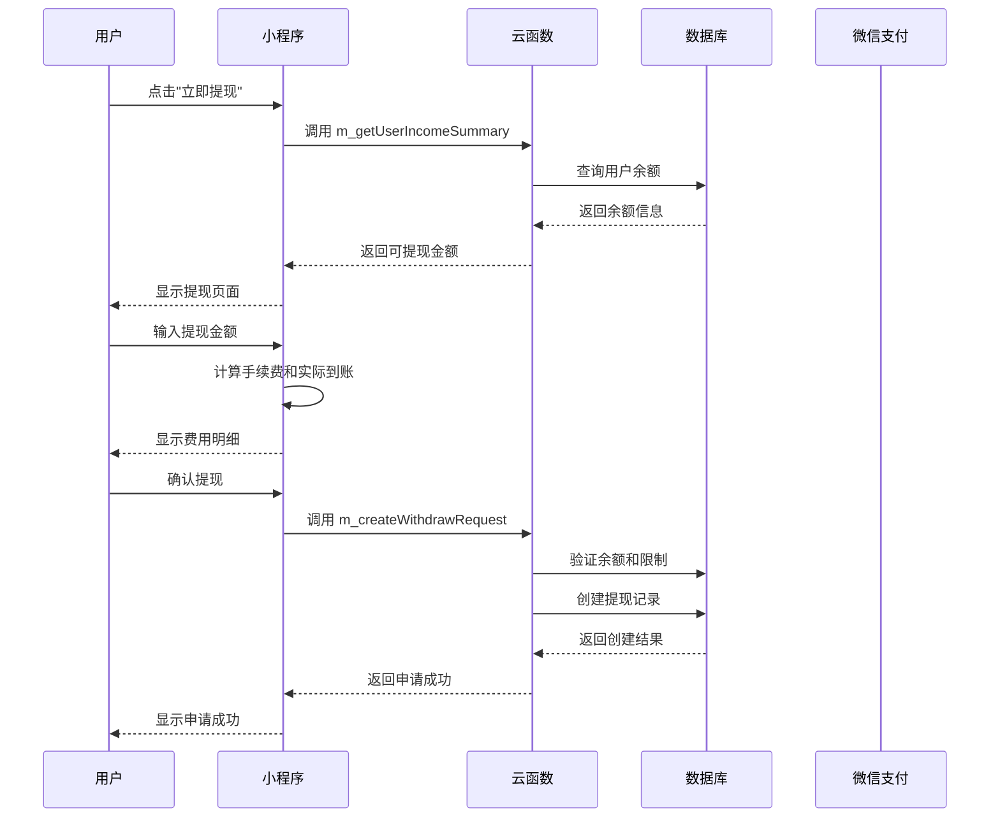
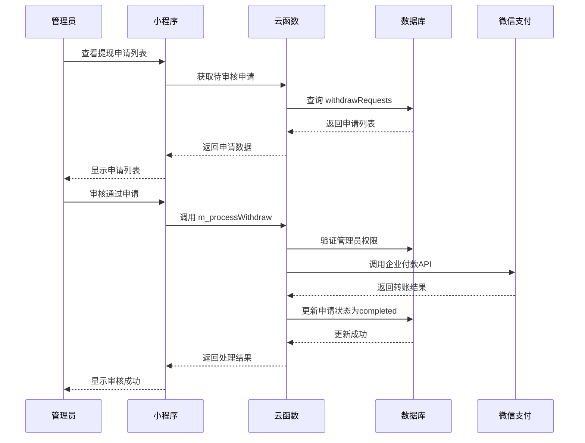

# 个人微信提现功能完整实现文档

## 概述

本文档详细记录了为"趣印星球管理端"小程序添加个人微信提现功能的完整实现过程，包括前端页面、后端云函数、数据库设计以及完整的业务流程。

## 功能特性

- ✅ 提现到当前登录的微信零钱账户
- ✅ 实时手续费计算(0.6%费率)
- ✅ 金额限制和频次控制
- ✅ 管理员审核流程
- ✅ 完整的状态跟踪
- ✅ 提现记录查询

## 技术架构

```
用户提现申请 → 云函数验证 → 管理员审核 → 微信转账 → 状态更新
```

---

## 一、前端实现

### 1.1 修改首页添加提现入口

#### 修改文件：`pages/index/index.wxml`

**位置**：在收益统计区域添加提现按钮

```xml
    <view class="stats">
      <view class="stat-item">
        <text class="label">收益总额</text>
        <text class="value">¥ {{totalAmount || 0}}</text>
      </view>
      <view class="stat-item">
        <text class="label">需结算金额</text>
        <text class="value">¥ {{toDistributeAmount || 0}}</text>
      </view>
      <view class="stat-item">
        <text class="label">待结算金额</text>
        <text class="value">¥ {{remainDistributableAmount || 0}}</text>
      </view>
    </view>
    
    <!-- 提现按钮区域 -->
    <view class="withdraw-section" wx:if="{{!isAdmin && remainDistributableAmount > 0}}">
      <van-button 
        color="#FF6B35" 
        size="normal" 
        round 
        bindtap="goWithdraw"
        custom-class="withdraw-btn"
      >
        立即提现
      </van-button>
    </view>
```

#### 修改文件：`pages/index/index.js`

**添加跳转方法**：

```javascript
  goWithdraw() {
    wx.navigateTo({ url: '/pages/withdraw/withdraw' });
  },
```

#### 修改文件：`pages/index/index.wxss`

**添加按钮样式**：

```css
/* 提现按钮区域 */
.withdraw-section {
  padding: 30rpx 0 10rpx 0;
  text-align: center;
}

.withdraw-btn {
  width: 300rpx;
  margin: 0 auto;
}
```

### 1.2 创建提现申请页面

#### 文件：`pages/withdraw/withdraw.js`

```javascript
import { checkLoginStatus, getUser } from '../../utils/auth';
const app = getApp();

Page({
  data: {
    availableAmount: 0,        // 可提现金额(元)
    withdrawAmount: '',        // 提现金额
    fee: 0,                   // 手续费(元)
    realAmount: 0,            // 实际到账(元)
    minAmount: 1,             // 最小提现额度(元)
    maxAmount: 5000,          // 最大提现额度(元)
    feeRate: 0.006,           // 手续费率 0.6%
    isSubmitting: false,      // 是否正在提交
    accountInfo: {
      type: 'wechat',
      name: '微信零钱',
      desc: '提现到当前登录的微信账号'
    }
  },

  onLoad(options) {
    if (!checkLoginStatus()) {
      wx.showToast({ title: '请先登录', icon: 'none' });
      setTimeout(() => {
        wx.navigateBack();
      }, 1500);
      return;
    }
    
    this.loadUserBalance();
    this.loadWithdrawConfig();
  },

  // 返回按钮处理
  onClickLeft() {
    wx.navigateBack();
  },

  // 加载用户可提现余额
  async loadUserBalance() {
    wx.showLoading({ title: '加载中...' });
    
    try {
      const res = await app.callSharedFunction({
        name: 'm_getUserIncomeSummary'
      });
      
      if (res.result.success) {
        const availableAmount = res.result.remainDistributableAmount || 0;
        this.setData({ 
          availableAmount: availableAmount
        });
      } else {
        wx.showToast({ title: '获取余额失败', icon: 'none' });
      }
    } catch (error) {
      console.error('获取用户余额失败:', error);
      wx.showToast({ title: '网络异常', icon: 'none' });
    } finally {
      wx.hideLoading();
    }
  },

  // 加载提现配置
  async loadWithdrawConfig() {
    try {
      const res = await app.callSharedFunction({
        name: 'm_getWithdrawConfig'
      });
      
      if (res.result.success) {
        const config = res.result.config;
        this.setData({
          minAmount: config.minAmount || 1,
          maxAmount: config.maxAmount || 5000,
          feeRate: config.feeRate || 0.006
        });
      }
    } catch (error) {
      console.log('获取提现配置失败:', error);
    }
  },

  // 输入金额时计算手续费和实际到账
  onAmountInput(e) {
    const amount = parseFloat(e.detail.value) || 0;
    const fee = this.calculateFee(amount);
    const realAmount = Math.max(0, amount - fee);
    
    this.setData({
      withdrawAmount: e.detail.value,
      fee: fee,
      realAmount: realAmount
    });
  },

  // 计算手续费
  calculateFee(amount) {
    if (amount <= 0) return 0;
    return Math.round(amount * this.data.feeRate * 100) / 100; // 保留2位小数
  },

  // 快速选择金额
  onQuickSelect(e) {
    const amount = e.currentTarget.dataset.amount;
    const fee = this.calculateFee(amount);
    const realAmount = amount - fee;
    
    this.setData({
      withdrawAmount: amount.toString(),
      fee: fee,
      realAmount: realAmount
    });
  },

  // 全部提现
  withdrawAll() {
    const amount = this.data.availableAmount;
    const fee = this.calculateFee(amount);
    const realAmount = amount - fee;
    
    this.setData({
      withdrawAmount: amount.toString(),
      fee: fee,
      realAmount: realAmount
    });
  },

  // 提交提现申请
  async submitWithdraw() {
    const { withdrawAmount, availableAmount, minAmount, maxAmount, realAmount } = this.data;
    const amount = parseFloat(withdrawAmount);
    
    // 验证输入
    if (!amount || amount <= 0) {
      wx.showToast({ title: '请输入提现金额', icon: 'none' });
      return;
    }
    
    if (amount < minAmount) {
      wx.showToast({ title: `最小提现金额为${minAmount}元`, icon: 'none' });
      return;
    }
    
    if (amount > maxAmount) {
      wx.showToast({ title: `最大提现金额为${maxAmount}元`, icon: 'none' });
      return;
    }
    
    if (amount > availableAmount) {
      wx.showToast({ title: '提现金额超过可用余额', icon: 'none' });
      return;
    }
    
    if (realAmount <= 0) {
      wx.showToast({ title: '实际到账金额必须大于0', icon: 'none' });
      return;
    }

    // 确认提现
    const result = await new Promise(resolve => {
      wx.showModal({
        title: '确认提现',
        content: `将提现${amount}元到微信零钱，手续费${this.data.fee}元，实际到账${realAmount}元`,
        success: resolve
      });
    });
    
    if (!result.confirm) return;

    // 提交申请
    this.setData({ isSubmitting: true });
    wx.showLoading({ title: '提交中...' });
    
    try {
      const res = await app.callSharedFunction({
        name: 'm_createWithdrawRequest',
        data: {
          amount: Math.round(amount * 100), // 转为分
        }
      });
      
      if (res.result.success) {
        wx.showToast({ title: '申请提交成功' });
        setTimeout(() => {
          wx.navigateBack();
        }, 1500);
      } else {
        wx.showToast({ 
          title: res.result.message || '申请失败', 
          icon: 'none' 
        });
      }
    } catch (error) {
      console.error('提现申请失败:', error);
      wx.showToast({ title: '网络异常，请重试', icon: 'none' });
    } finally {
      this.setData({ isSubmitting: false });
      wx.hideLoading();
    }
  },

  // 查看提现记录
  viewRecords() {
    wx.navigateTo({
      url: '/pages/withdraw-records/records'
    });
  }
});
```

#### 文件：`pages/withdraw/withdraw.json`

```json
{
  "usingComponents": {
    "van-nav-bar": "@vant/weapp/nav-bar/index",
    "van-cell": "@vant/weapp/cell/index",
    "van-cell-group": "@vant/weapp/cell-group/index",
    "van-field": "@vant/weapp/field/index",
    "van-button": "@vant/weapp/button/index",
    "van-tag": "@vant/weapp/tag/index"
  },
  "navigationBarTitleText": "提现"
}
```

#### 文件：`pages/withdraw/withdraw.wxml`

```xml
<view class="withdraw-page">
  <van-nav-bar
    title="提现"
    left-text="返回"
    left-arrow
    bind:click-left="onClickLeft"
  />

  <!-- 可提现金额显示 -->
  <view class="balance-section">
    <view class="balance-card">
      <view class="balance-title">可提现金额</view>
      <view class="balance-amount">¥ {{availableAmount}}</view>
      <view class="balance-tip">提现将收取{{(feeRate * 100).toFixed(1)}}%手续费</view>
    </view>
  </view>

  <!-- 提现账户信息 -->
  <van-cell-group title="提现账户" custom-class="account-group">
    <van-cell 
      title="{{accountInfo.name}}" 
      label="{{accountInfo.desc}}"
      icon="wechat"
    />
  </van-cell-group>

  <!-- 提现金额输入 -->
  <van-cell-group title="提现金额" custom-class="amount-group">
    <van-field
      value="{{withdrawAmount}}"
      type="digit"
      placeholder="请输入提现金额"
      bind:change="onAmountInput"
      clearable
    >
      <view slot="right-icon" class="amount-unit">元</view>
    </van-field>
  </van-cell-group>

  <!-- 快速选择金额 -->
  <view class="quick-select">
    <view class="quick-title">快速选择</view>
    <view class="quick-buttons">
      <van-button 
        size="small" 
        plain 
        data-amount="100" 
        bindtap="onQuickSelect"
      >
        100元
      </van-button>
      <van-button 
        size="small" 
        plain 
        data-amount="500" 
        bindtap="onQuickSelect"
      >
        500元
      </van-button>
      <van-button 
        size="small" 
        plain 
        data-amount="1000" 
        bindtap="onQuickSelect"
      >
        1000元
      </van-button>
      <van-button 
        size="small" 
        plain 
        bindtap="withdrawAll"
      >
        全部
      </van-button>
    </view>
  </view>

  <!-- 费用明细 -->
  <view class="fee-detail" wx:if="{{withdrawAmount && withdrawAmount > 0}}">
    <van-cell-group title="费用明细">
      <van-cell title="提现金额" value="¥ {{withdrawAmount}}" />
      <van-cell title="手续费" value="¥ {{fee.toFixed(2)}}" />
      <van-cell 
        title="实际到账" 
        value="¥ {{realAmount.toFixed(2)}}" 
        value-class="highlight-amount"
      />
    </van-cell-group>
  </view>

  <!-- 提现说明 -->
  <view class="withdraw-tips">
    <view class="tip-title">提现说明</view>
    <view class="tip-item">• 提现金额范围：{{minAmount}}-{{maxAmount}}元</view>
    <view class="tip-item">• 手续费率：{{(feeRate * 100).toFixed(1)}}%</view>
    <view class="tip-item">• 资金将转入您当前登录的微信零钱</view>
    <view class="tip-item">• 提现申请提交后需要管理员审核</view>
    <view class="tip-item">• 审核通过后资金将在1-3个工作日内到账</view>
  </view>

  <!-- 底部按钮 -->
  <view class="bottom-actions">
    <van-button 
      type="info" 
      size="normal"
      plain
      bindtap="viewRecords"
      custom-class="records-btn"
    >
      提现记录
    </van-button>
    <van-button 
      type="primary" 
      size="normal"
      bindtap="submitWithdraw"
      loading="{{isSubmitting}}"
      disabled="{{!withdrawAmount || withdrawAmount <= 0 || isSubmitting}}"
      custom-class="submit-btn"
    >
      确认提现
    </van-button>
  </view>
</view>
```

#### 文件：`pages/withdraw/withdraw.wxss`

```css
/* pages/withdraw/withdraw.wxss */
.withdraw-page {
  min-height: 100vh;
  background-color: #f7f8fa;
}

/* 余额展示区域 */
.balance-section {
  padding: 20rpx;
  margin-bottom: 20rpx;
}

.balance-card {
  background: linear-gradient(135deg, #667eea 0%, #764ba2 100%);
  border-radius: 20rpx;
  padding: 40rpx 30rpx;
  text-align: center;
  color: white;
}

.balance-title {
  font-size: 28rpx;
  opacity: 0.9;
  margin-bottom: 10rpx;
}

.balance-amount {
  font-size: 56rpx;
  font-weight: bold;
  margin-bottom: 10rpx;
}

.balance-tip {
  font-size: 24rpx;
  opacity: 0.8;
}

/* 表单组件样式 */
.account-group {
  margin-bottom: 20rpx;
}

.amount-group {
  margin-bottom: 20rpx;
}

.amount-unit {
  color: #969799;
  font-size: 28rpx;
}

/* 快速选择区域 */
.quick-select {
  padding: 20rpx;
  margin-bottom: 20rpx;
}

.quick-title {
  font-size: 28rpx;
  color: #323233;
  margin-bottom: 20rpx;
}

.quick-buttons {
  display: flex;
  gap: 20rpx;
}

.quick-buttons .van-button {
  flex: 1;
}

/* 费用明细 */
.fee-detail {
  margin-bottom: 20rpx;
}

.highlight-amount {
  color: #ee0a24 !important;
  font-weight: bold;
}

/* 提现说明 */
.withdraw-tips {
  background: white;
  margin: 20rpx;
  padding: 30rpx;
  border-radius: 16rpx;
}

.tip-title {
  font-size: 30rpx;
  font-weight: bold;
  color: #323233;
  margin-bottom: 20rpx;
}

.tip-item {
  font-size: 26rpx;
  color: #646566;
  line-height: 1.6;
  margin-bottom: 10rpx;
}

/* 底部操作区域 */
.bottom-actions {
  position: fixed;
  bottom: 0;
  left: 0;
  right: 0;
  padding: 20rpx;
  background: white;
  border-top: 1rpx solid #ebedf0;
  display: flex;
  gap: 20rpx;
}

.records-btn {
  flex: 1;
}

.submit-btn {
  flex: 2;
}

/* 为底部按钮预留空间 */
.withdraw-page {
  padding-bottom: 120rpx;
}
```

### 1.3 创建提现记录页面

#### 文件：`pages/withdraw-records/records.js`

```javascript
import { checkLoginStatus } from '../../utils/auth';
const app = getApp();

Page({
  data: {
    recordList: [],         // 提现记录列表
    page: 1,               // 当前页码
    limit: 10,             // 每页数量
    isLoading: false,      // 是否正在加载
    noMoreData: false,     // 是否无更多数据
    statusFilter: '',      // 状态筛选
    statusOptions: [
      { text: '全部', value: '' },
      { text: '待审核', value: 'pending' },
      { text: '审核通过', value: 'approved' },
      { text: '处理中', value: 'processing' },
      { text: '已完成', value: 'completed' },
      { text: '已拒绝', value: 'rejected' },
      { text: '失败', value: 'failed' }
    ]
  },

  onLoad() {
    if (!checkLoginStatus()) {
      wx.showToast({ title: '请先登录', icon: 'none' });
      setTimeout(() => {
        wx.navigateBack();
      }, 1500);
      return;
    }
    
    this.loadRecords(true);
  },

  // 返回按钮处理
  onClickLeft() {
    wx.navigateBack();
  },

  onPullDownRefresh() {
    this.loadRecords(true);
  },

  onReachBottom() {
    if (!this.data.noMoreData && !this.data.isLoading) {
      this.loadRecords(false);
    }
  },

  // 加载提现记录
  async loadRecords(reset = false) {
    if (this.data.isLoading) return;
    
    this.setData({ isLoading: true });
    
    if (reset) {
      this.setData({ 
        page: 1, 
        recordList: [], 
        noMoreData: false 
      });
    }

    try {
      const res = await app.callSharedFunction({
        name: 'm_getWithdrawRecords',
        data: {
          page: this.data.page,
          limit: this.data.limit,
          status: this.data.statusFilter
        }
      });

      if (res.result.success) {
        const newRecords = res.result.records || [];
        const allRecords = reset ? newRecords : [...this.data.recordList, ...newRecords];
        
        this.setData({
          recordList: allRecords,
          page: this.data.page + 1,
          noMoreData: newRecords.length < this.data.limit
        });
      } else {
        wx.showToast({ 
          title: res.result.message || '加载失败', 
          icon: 'none' 
        });
      }
    } catch (error) {
      console.error('加载提现记录失败:', error);
      wx.showToast({ title: '网络异常', icon: 'none' });
    } finally {
      this.setData({ isLoading: false });
      wx.stopPullDownRefresh();
    }
  },

  // 状态筛选
  onStatusFilter(e) {
    const status = e.currentTarget.dataset.status;
    if (status === this.data.statusFilter) return;
    
    this.setData({ statusFilter: status });
    this.loadRecords(true);
  },

  // 查看记录详情
  viewDetail(e) {
    const recordId = e.currentTarget.dataset.id;
    wx.navigateTo({
      url: `/pages/withdraw-detail/detail?id=${recordId}`
    });
  },

  // 格式化状态文本
  formatStatus(status) {
    const statusMap = {
      'pending': { text: '待审核', color: '#ff9500' },
      'approved': { text: '审核通过', color: '#07c160' },
      'processing': { text: '处理中', color: '#10aeff' },
      'completed': { text: '已完成', color: '#07c160' },
      'rejected': { text: '已拒绝', color: '#ee0a24' },
      'failed': { text: '失败', color: '#ee0a24' }
    };
    return statusMap[status] || { text: '未知', color: '#969799' };
  },

  // 格式化时间
  formatTime(dateStr) {
    if (!dateStr) return '';
    const date = new Date(dateStr);
    return `${date.getFullYear()}-${String(date.getMonth() + 1).padStart(2, '0')}-${String(date.getDate()).padStart(2, '0')} ${String(date.getHours()).padStart(2, '0')}:${String(date.getMinutes()).padStart(2, '0')}`;
  }
});
```

#### 文件：`pages/withdraw-records/records.json`

```json
{
  "usingComponents": {
    "van-nav-bar": "@vant/weapp/nav-bar/index",
    "van-cell": "@vant/weapp/cell/index",
    "van-tag": "@vant/weapp/tag/index",
    "van-empty": "@vant/weapp/empty/index",
    "van-loading": "@vant/weapp/loading/index"
  },
  "navigationBarTitleText": "提现记录",
  "enablePullDownRefresh": true
}
```

#### 文件：`pages/withdraw-records/records.wxml`

```xml
<view class="records-page">
  <van-nav-bar
    title="提现记录"
    left-text="返回"
    left-arrow
    bind:click-left="onClickLeft"
  />

  <!-- 状态筛选 -->
  <view class="filter-section">
    <scroll-view scroll-x class="status-filter">
      <view 
        class="filter-item {{statusFilter === item.value ? 'active' : ''}}"
        wx:for="{{statusOptions}}"
        wx:key="value"
        data-status="{{item.value}}"
        bindtap="onStatusFilter"
      >
        {{item.text}}
      </view>
    </scroll-view>
  </view>

  <!-- 记录列表 -->
  <view class="records-list">
    <view 
      class="record-item"
      wx:for="{{recordList}}"
      wx:key="id"
      data-id="{{item.id}}"
      bindtap="viewDetail"
    >
      <!-- 记录头部信息 -->
      <view class="record-header">
        <view class="record-title">
          <text class="amount-text">¥{{(item.amount / 100).toFixed(2)}}</text>
          <van-tag 
            color="{{formatStatus(item.status).color}}"
            text-color="#fff"
          >
            {{formatStatus(item.status).text}}
          </van-tag>
        </view>
        <view class="record-time">{{formatTime(item.applyTime)}}</view>
      </view>

      <!-- 记录详细信息 -->
      <view class="record-body">
        <view class="record-info">
          <view class="info-row">
            <text class="info-label">手续费：</text>
            <text class="info-value">¥{{(item.fee / 100).toFixed(2)}}</text>
          </view>
          <view class="info-row">
            <text class="info-label">实际到账：</text>
            <text class="info-value highlight">¥{{(item.realAmount / 100).toFixed(2)}}</text>
          </view>
        </view>
        
        <!-- 处理时间 -->
        <view class="info-row" wx:if="{{item.processTime}}">
          <text class="info-label">处理时间：</text>
          <text class="info-value">{{formatTime(item.processTime)}}</text>
        </view>
        
        <!-- 完成时间 -->
        <view class="info-row" wx:if="{{item.completeTime}}">
          <text class="info-label">完成时间：</text>
          <text class="info-value">{{formatTime(item.completeTime)}}</text>
        </view>
        
        <!-- 失败原因 -->
        <view class="info-row" wx:if="{{item.failReason}}">
          <text class="info-label">失败原因：</text>
          <text class="info-value error">{{item.failReason}}</text>
        </view>
        
        <!-- 备注 -->
        <view class="info-row" wx:if="{{item.remark}}">
          <text class="info-label">备注：</text>
          <text class="info-value">{{item.remark}}</text>
        </view>
      </view>
    </view>

    <!-- 加载更多 -->
    <view class="loading-more" wx:if="{{isLoading}}">
      <van-loading size="20px" text="加载中..." />
    </view>

    <!-- 无更多数据 -->
    <view class="no-more" wx:if="{{noMoreData && recordList.length > 0}}">
      没有更多记录了
    </view>

    <!-- 空状态 -->
    <van-empty 
      wx:if="{{recordList.length === 0 && !isLoading}}"
      description="暂无提现记录"
    />
  </view>
</view>
```

#### 文件：`pages/withdraw-records/records.wxss`

```css
/* pages/withdraw-records/records.wxss */
.records-page {
  min-height: 100vh;
  background-color: #f7f8fa;
}

/* 状态筛选区域 */
.filter-section {
  background: white;
  padding: 20rpx 0;
  border-bottom: 1rpx solid #ebedf0;
}

.status-filter {
  white-space: nowrap;
  padding: 0 20rpx;
}

.filter-item {
  display: inline-block;
  padding: 10rpx 24rpx;
  margin-right: 20rpx;
  font-size: 26rpx;
  color: #646566;
  background: #f2f3f5;
  border-radius: 20rpx;
  transition: all 0.3s;
}

.filter-item.active {
  color: #1989fa;
  background: #e8f3ff;
}

/* 记录列表 */
.records-list {
  padding: 20rpx;
}

.record-item {
  background: white;
  border-radius: 16rpx;
  padding: 30rpx;
  margin-bottom: 20rpx;
  box-shadow: 0 2rpx 12rpx rgba(100, 101, 102, 0.1);
}

/* 记录头部 */
.record-header {
  display: flex;
  justify-content: space-between;
  align-items: center;
  margin-bottom: 20rpx;
}

.record-title {
  display: flex;
  align-items: center;
  gap: 20rpx;
}

.amount-text {
  font-size: 36rpx;
  font-weight: bold;
  color: #323233;
}

.record-time {
  font-size: 24rpx;
  color: #969799;
}

/* 记录详细信息 */
.record-body {
  border-top: 1rpx solid #f0f1f5;
  padding-top: 20rpx;
}

.record-info {
  display: flex;
  gap: 40rpx;
  margin-bottom: 10rpx;
}

.info-row {
  display: flex;
  margin-bottom: 10rpx;
  font-size: 26rpx;
}

.info-label {
  color: #969799;
  min-width: 120rpx;
}

.info-value {
  color: #323233;
  flex: 1;
}

.info-value.highlight {
  color: #ee0a24;
  font-weight: bold;
}

.info-value.error {
  color: #ee0a24;
}

/* 加载状态 */
.loading-more {
  text-align: center;
  padding: 40rpx 0;
}

.no-more {
  text-align: center;
  color: #969799;
  font-size: 26rpx;
  padding: 40rpx 0;
}
```

### 1.4 更新 app.json

#### 修改文件：`app.json`

**添加新页面路由**：

```json
{
  "pages": [
    "pages/index/index",
    "pages/search/search",
    "pages/order/order",
    "pages/setting/setting",
    "pages/login/login",
    "pages/info/info",
    "pages/withdraw/withdraw",
    "pages/withdraw-records/records"
  ],
  "window": {
    "backgroundColor": "#F6F6F6",
    "backgroundTextStyle": "light",
    "navigationBarBackgroundColor": "#F6F6F6",
    "navigationBarTitleText": "趣印星球管理端",
    "navigationStyle": "custom",
    "navigationBarTextStyle": "black"
  },
  "sitemapLocation": "sitemap.json",
  "style": "v2",
  "lazyCodeLoading": "requiredComponents"
}
```

---

## 二、后端云函数实现

### 2.1 创建提现申请云函数

#### 文件：`m_createWithdrawRequest.js`

```javascript
// 云函数: m_createWithdrawRequest
// 创建提现申请
const cloud = require('wx-server-sdk');
cloud.init({
  env: cloud.DYNAMIC_CURRENT_ENV
});

const db = cloud.database();
const _ = db.command;

exports.main = async (event, context) => {
  const { amount } = event; // 提现金额(分)
  const { OPENID } = cloud.getWXContext();
  
  try {
    // 1. 验证用户身份
    const userRes = await db.collection('users')
      .where({ userId: OPENID })
      .get();
      
    if (userRes.data.length === 0) {
      return { success: false, message: '用户不存在' };
    }
    
    const user = userRes.data[0];
    
    // 2. 获取用户收益信息
    const incomeRes = await cloud.callFunction({
      name: 'm_getUserIncomeSummary',
      data: {}
    });
    
    if (!incomeRes.result.success) {
      return { success: false, message: '获取收益信息失败' };
    }
    
    const availableAmount = incomeRes.result.remainDistributableAmount * 100; // 转为分
    
    // 3. 验证提现金额
    if (amount <= 0) {
      return { success: false, message: '提现金额必须大于0' };
    }
    
    if (amount > availableAmount) {
      return { success: false, message: '提现金额超过可用余额' };
    }
    
    // 4. 获取提现配置
    const config = await getWithdrawConfig();
    const minAmount = config.minAmount * 100; // 转为分
    const maxAmount = config.maxAmount * 100; // 转为分
    
    if (amount < minAmount || amount > maxAmount) {
      return { 
        success: false, 
        message: `提现金额范围：${config.minAmount}-${config.maxAmount}元` 
      };
    }
    
    // 5. 检查今日提现次数限制
    const today = new Date();
    today.setHours(0, 0, 0, 0);
    const tomorrow = new Date(today);
    tomorrow.setDate(tomorrow.getDate() + 1);
    
    const todayCount = await db.collection('withdrawRequests')
      .where({
        userId: OPENID,
        applyTime: _.gte(today).and(_.lt(tomorrow))
      })
      .count();
      
    if (todayCount.total >= config.dailyLimit) {
      return { success: false, message: '今日提现次数已达上限' };
    }
    
    // 6. 计算手续费
    const fee = Math.ceil(amount * config.feeRate);
    const realAmount = amount - fee;
    
    if (realAmount <= 0) {
      return { success: false, message: '扣除手续费后金额不足' };
    }
    
    // 7. 创建提现记录
    const withdrawId = generateWithdrawId();
    const withdrawData = {
      id: withdrawId,
      userId: OPENID,
      amount: amount,
      fee: fee,
      realAmount: realAmount,
      status: 'pending',
      applyTime: new Date(),
      accountType: 'wechat',
      accountInfo: {
        openid: OPENID,
        nickname: user.nickname || '微信用户'
      },
      createTime: new Date(),
      updateTime: new Date()
    };
    
    await db.collection('withdrawRequests').add({
      data: withdrawData
    });
    
    return { 
      success: true, 
      message: '申请提交成功',
      withdrawId: withdrawId
    };
    
  } catch (error) {
    console.error('创建提现申请失败:', error);
    return { success: false, message: '系统异常，请重试' };
  }
};

// 获取提现配置
async function getWithdrawConfig() {
  try {
    const res = await db.collection('withdrawConfig')
      .doc('default')
      .get();
      
    if (res.data) {
      return res.data;
    }
  } catch (error) {
    console.log('获取提现配置失败，使用默认配置');
  }
  
  // 默认配置
  return {
    minAmount: 1,      // 最小提现金额(元)
    maxAmount: 5000,   // 最大提现金额(元)
    feeRate: 0.006,    // 手续费率 0.6%
    dailyLimit: 3,     // 每日提现次数限制
    enabled: true      // 是否开启提现
  };
}

// 生成提现订单号
function generateWithdrawId() {
  const timestamp = Date.now();
  const random = Math.floor(Math.random() * 1000).toString().padStart(3, '0');
  return `WD${timestamp}${random}`;
}
```

### 2.2 获取提现配置云函数

#### 文件：`m_getWithdrawConfig.js`

```javascript
// 云函数: m_getWithdrawConfig
// 获取提现配置
const cloud = require('wx-server-sdk');
cloud.init({
  env: cloud.DYNAMIC_CURRENT_ENV
});

const db = cloud.database();

exports.main = async (event, context) => {
  try {
    const res = await db.collection('withdrawConfig')
      .doc('default')
      .get();
      
    let config;
    if (res.data) {
      config = res.data;
    } else {
      // 如果没有配置，创建默认配置
      config = {
        minAmount: 1,      // 最小提现金额(元)
        maxAmount: 5000,   // 最大提现金额(元)  
        feeRate: 0.006,    // 手续费率 0.6%
        dailyLimit: 3,     // 每日提现次数限制
        enabled: true      // 是否开启提现
      };
      
      await db.collection('withdrawConfig').doc('default').set({
        data: config
      });
    }
    
    return {
      success: true,
      config: config
    };
    
  } catch (error) {
    console.error('获取提现配置失败:', error);
    return {
      success: false,
      message: '获取配置失败',
      // 返回默认配置
      config: {
        minAmount: 1,
        maxAmount: 5000,
        feeRate: 0.006,
        dailyLimit: 3,
        enabled: true
      }
    };
  }
};
```

### 2.3 获取提现记录云函数

#### 文件：`m_getWithdrawRecords.js`

```javascript
// 云函数: m_getWithdrawRecords
// 获取用户提现记录
const cloud = require('wx-server-sdk');
cloud.init({
  env: cloud.DYNAMIC_CURRENT_ENV
});

const db = cloud.database();
const _ = db.command;

exports.main = async (event, context) => {
  const { page = 1, limit = 10, status = '' } = event;
  const { OPENID } = cloud.getWXContext();
  
  try {
    // 构建查询条件
    let whereCondition = { userId: OPENID };
    
    if (status) {
      whereCondition.status = status;
    }
    
    // 分页查询
    const skip = (page - 1) * limit;
    
    const res = await db.collection('withdrawRequests')
      .where(whereCondition)
      .orderBy('applyTime', 'desc')
      .skip(skip)
      .limit(limit)
      .get();
    
    // 格式化记录数据
    const records = res.data.map(record => ({
      id: record.id,
      amount: record.amount,
      fee: record.fee,
      realAmount: record.realAmount,
      status: record.status,
      applyTime: record.applyTime,
      processTime: record.processTime,
      completeTime: record.completeTime,
      failReason: record.failReason,
      remark: record.remark,
      wechatOrderNo: record.wechatOrderNo
    }));
    
    return {
      success: true,
      records: records,
      total: res.data.length,
      hasMore: res.data.length >= limit
    };
    
  } catch (error) {
    console.error('获取提现记录失败:', error);
    return {
      success: false,
      message: '获取记录失败',
      records: []
    };
  }
};
```

### 2.4 处理提现申请云函数（管理员用）

#### 文件：`m_processWithdraw.js`

```javascript
// 云函数: m_processWithdraw
// 处理提现申请（管理员功能）
const cloud = require('wx-server-sdk');
cloud.init({
  env: cloud.DYNAMIC_CURRENT_ENV
});

const db = cloud.database();

exports.main = async (event, context) => {
  const { withdrawId, action, remark = '' } = event; // action: approve|reject
  const { OPENID } = cloud.getWXContext();
  
  try {
    // 1. 验证管理员权限
    const isAdmin = await checkAdminPermission(OPENID);
    if (!isAdmin) {
      return { success: false, message: '无权限操作' };
    }
    
    // 2. 获取提现申请
    const withdrawRes = await db.collection('withdrawRequests')
      .where({ id: withdrawId })
      .get();
      
    if (withdrawRes.data.length === 0) {
      return { success: false, message: '提现记录不存在' };
    }
    
    const withdraw = withdrawRes.data[0];
    
    if (withdraw.status !== 'pending') {
      return { success: false, message: '该申请已被处理' };
    }
    
    // 3. 处理申请
    if (action === 'approve') {
      // 审核通过，进行微信转账
      const transferResult = await wechatTransfer(withdraw);
      
      if (transferResult.success) {
        // 转账成功，更新状态为已完成
        await db.collection('withdrawRequests')
          .where({ id: withdrawId })
          .update({
            data: {
              status: 'completed',
              processTime: new Date(),
              completeTime: new Date(),
              adminId: OPENID,
              wechatOrderNo: transferResult.orderNo,
              remark: remark,
              updateTime: new Date()
            }
          });
          
        return { success: true, message: '审核通过，转账成功' };
      } else {
        // 转账失败
        await db.collection('withdrawRequests')
          .where({ id: withdrawId })
          .update({
            data: {
              status: 'failed',
              processTime: new Date(),
              adminId: OPENID,
              failReason: transferResult.error,
              remark: remark,
              updateTime: new Date()
            }
          });
          
        return { success: false, message: `转账失败: ${transferResult.error}` };
      }
      
    } else if (action === 'reject') {
      // 拒绝申请
      await db.collection('withdrawRequests')
        .where({ id: withdrawId })
        .update({
          data: {
            status: 'rejected',
            processTime: new Date(),
            adminId: OPENID,
            remark: remark,
            updateTime: new Date()
          }
        });
        
      return { success: true, message: '申请已拒绝' };
    } else {
      return { success: false, message: '无效的操作' };
    }
    
  } catch (error) {
    console.error('处理提现申请失败:', error);
    return { success: false, message: '系统异常，请重试' };
  }
};

// 检查管理员权限
async function checkAdminPermission(openid) {
  try {
    const res = await db.collection('users')
      .where({ userId: openid })
      .get();
      
    if (res.data.length > 0) {
      const user = res.data[0];
      return user.identityId === 'R0000' || user.identityId === 'R0001';
    }
    
    return false;
  } catch (error) {
    return false;
  }
}

// 微信企业付款
async function wechatTransfer(withdraw) {
  try {
    // 注意：这里需要配置微信支付商户号和证书
    const payment = cloud.cloudPay({
      secretId: 'your_secret_id',
      secretKey: 'your_secret_key',  
      mchId: 'your_mch_id',
      key: 'your_api_key'
    });
    
    const result = await payment.transfers({
      partner_trade_no: withdraw.id,
      openid: withdraw.userId,
      amount: withdraw.realAmount, // 实际到账金额(分)
      desc: '趣印星球提现',
      check_name: 'NO_CHECK'
    });
    
    return {
      success: true,
      orderNo: result.payment_no
    };
    
  } catch (error) {
    console.error('微信转账失败:', error);
    return {
      success: false,
      error: error.message || '转账失败'
    };
  }
}
```

---

## 三、数据库设计

### 3.1 数据库集合结构

#### withdrawRequests（提现申请集合）

```json
{
  "id": "WD1641234567890001",           // 提现订单号
  "userId": "用户openid",                // 申请用户ID
  "amount": 10000,                      // 提现金额(分)
  "fee": 60,                           // 手续费(分)
  "realAmount": 9940,                  // 实际到账金额(分)
  "status": "pending",                 // 状态: pending|approved|rejected|processing|completed|failed
  "applyTime": "2025-01-04T10:00:00Z", // 申请时间
  "processTime": null,                 // 处理时间
  "completeTime": null,                // 完成时间
  "accountType": "wechat",             // 账户类型
  "accountInfo": {                     // 账户信息
    "openid": "用户openid",
    "nickname": "用户昵称"
  },
  "adminId": null,                     // 处理管理员ID
  "wechatOrderNo": null,               // 微信订单号
  "failReason": null,                  // 失败原因
  "remark": null,                      // 备注
  "createTime": "2025-01-04T10:00:00Z",// 创建时间
  "updateTime": "2025-01-04T10:00:00Z" // 更新时间
}
```

#### withdrawConfig（提现配置集合）

```json
{
  "_id": "default",      // 固定ID
  "minAmount": 1,        // 最小提现金额(元)
  "maxAmount": 5000,     // 最大提现金额(元)
  "feeRate": 0.006,      // 手续费率 0.6%
  "dailyLimit": 3,       // 每日提现次数限制
  "enabled": true        // 是否开启提现
}
```

### 3.2 数据库权限设置

#### withdrawRequests 权限
- **读权限**：`auth.uid == doc.userId || (auth.uid != null && doc._openid != auth.uid)`
- **写权限**：`auth.uid != null`

#### withdrawConfig 权限  
- **读权限**：`auth.uid != null`
- **写权限**：`auth.uid != null`

### 3.3 索引创建

#### withdrawRequests 索引
- `userId` (单字段索引)
- `status` (单字段索引)  
- `applyTime` (单字段索引，降序)
- `userId + status` (复合索引)
- `userId + applyTime` (复合索引)

---

## 四、业务流程

### 4.1 用户提现流程



### 4.2 管理员审核流程



### 4.3 状态流转

```
pending (待审核) 
    ↓
approved (审核通过) → processing (处理中) → completed (已完成)
    ↓                                      ↓
rejected (已拒绝)                          failed (失败)
```

**状态说明**：
- `pending`: 用户提交申请，等待管理员审核
- `approved`: 管理员审核通过，准备转账
- `processing`: 正在调用微信转账API
- `completed`: 转账成功，提现完成
- `rejected`: 管理员拒绝申请
- `failed`: 转账失败

---

## 五、部署和测试

### 5.1 部署清单

#### 前端部署
- [ ] 上传小程序代码
- [ ] 更新 `app.json` 页面路由
- [ ] 编译和预览测试

#### 后端部署
- [ ] 上传云函数：
  - `m_createWithdrawRequest`
  - `m_getWithdrawConfig` 
  - `m_getWithdrawRecords`
  - `m_processWithdraw`
- [ ] 创建数据库集合：
  - `withdrawRequests`
  - `withdrawConfig`
- [ ] 设置集合权限和索引

#### 配置项
- [ ] 微信商户号配置（用于实际转账）
- [ ] 提现参数配置（金额限制、手续费率等）

### 5.2 测试用例

#### 基础功能测试
1. **提现入口测试**
   - 登录普通用户，验证首页显示提现按钮
   - 登录管理员，验证不显示提现按钮

2. **提现申请测试**
   - 测试余额显示正确性
   - 测试金额输入和手续费计算
   - 测试表单验证（金额范围、余额不足等）
   - 测试申请提交成功

3. **提现记录测试**
   - 查看提现记录列表
   - 测试状态筛选功能
   - 测试分页加载

#### 边界条件测试
1. **金额限制测试**
   - 最小金额：< 1元
   - 最大金额：> 5000元
   - 超过余额：提现金额 > 可用余额

2. **频率限制测试**
   - 单日多次申请测试
   - 达到每日限额后的提示

3. **权限测试**
   - 未登录用户访问提现页面
   - 普通用户访问管理员功能

### 5.3 注意事项

1. **微信支付配置**
   - 当前代码中的转账功能为示例，需要配置真实商户信息
   - 开通企业付款到零钱权限
   - 配置API证书和密钥

2. **安全考虑**
   - 所有用户输入都需要验证
   - 防止重复提交
   - 敏感操作记录日志

3. **用户体验**
   - 加载状态提示
   - 错误信息友好显示
   - 操作反馈及时

---

## 六、扩展功能

### 6.1 可选扩展

1. **提现到银行卡**
   - 支持绑定银行卡
   - 身份验证功能
   - 银行卡转账API集成

2. **提现明细导出**
   - Excel导出功能
   - 财务报表生成

3. **提现统计分析**
   - 提现趋势图表
   - 手续费统计
   - 用户提现行为分析

4. **消息通知**
   - 提现状态变更通知
   - 微信模板消息推送

### 6.2 性能优化

1. **数据缓存**
   - 用户余额缓存
   - 配置信息缓存

2. **分页优化**
   - 虚拟列表
   - 懒加载

3. **网络优化**
   - 请求合并
   - 离线缓存

---

## 七、总结

本文档记录了完整的个人微信提现功能实现，包括：

- **前端实现**：提现申请页面、提现记录页面、首页入口修改
- **后端实现**：4个核心云函数，完整的业务逻辑处理
- **数据库设计**：2个核心集合，完善的权限和索引配置
- **业务流程**：用户申请、管理员审核、状态流转的完整流程
- **部署测试**：详细的部署步骤和测试用例

该实现具有以下特点：
- ✅ **安全可靠**：严格的权限控制和数据验证
- ✅ **用户友好**：直观的界面和清晰的操作流程
- ✅ **功能完整**：涵盖申请、审核、记录查询等全流程
- ✅ **易于维护**：模块化设计，代码结构清晰
- ✅ **扩展性强**：预留了多种扩展接口

该功能已可直接部署使用，后续可根据业务需求进行功能扩展和性能优化。