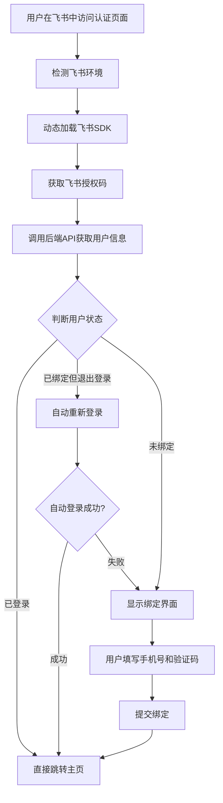
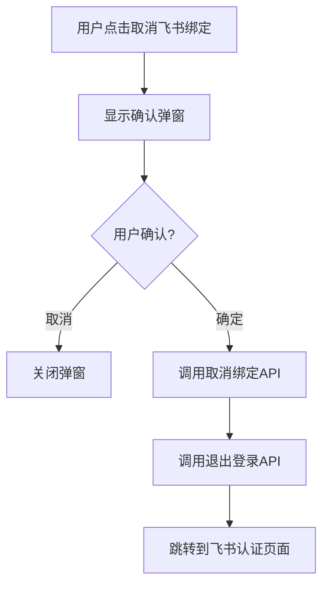

# 飞书免登录系统开发文档

## 概述

本文档详细记录了自在招聘平台的飞书免登录系统的完整实现方案，包括架构设计、技术实现、用户流程和关键代码逻辑。

## 系统架构

### 1. 核心组件

```
飞书免登录系统
├── 前端组件
│   ├── 飞书认证页面 (/client/src/pages/feishu/auth.vue)
│   ├── 用户菜单组件 (/client/src/components/Header/components/Personal.vue)
│   └── 飞书工具模块 (/client/src/utils/feishu.js)
├── 后端API
│   ├── /api/isv/feishu/getappid - 获取飞书应用ID
│   ├── /api/isv/feishu/getuserinfo - 获取飞书用户信息
│   ├── /api/user/fsreglogin - 飞书注册/登录
│   ├── /api/user/fsunbind - 取消飞书绑定
│   └── /api/user/logout - 用户退出登录
└── 公共工具
    └── util.isFeishuEnv() - 飞书环境检测
```

### 2. 技术特点

- **组件级动态加载**: 飞书SDK按需加载，避免全局污染
- **智能登录状态判断**: 支持已登录、已绑定未登录、未绑定三种状态
- **优雅降级处理**: 认证失败时静默处理，不显示错误提示
- **完整的绑定/解绑流程**: 包含确认弹窗和状态清理

## 用户流程设计

### 3.1 飞书免登录主流程



### 3.2 取消绑定流程



## 核心技术实现

### 4.1 动态SDK加载机制

**文件**: `/client/src/utils/feishu.js`

```javascript
// 动态加载飞书SDK的核心逻辑
export function loadFeishuSDK(options = {}) {
  const { 
    timeout = 15000, 
    enableDebug = process.env.NODE_ENV === 'development' 
  } = options;
  
  return new Promise((resolve, reject) => {
    // 防重复加载检查
    if (window.FEISHU_SDK_LOADED && window.h5sdk && window.tt) {
      resolve();
      return;
    }
    
    // 并发加载处理
    if (window.FEISHU_SDK_LOADING) {
      const onReady = () => {
        window.removeEventListener('feishu-sdk-ready', onReady);
        resolve();
      };
      window.addEventListener('feishu-sdk-ready', onReady);
      return;
    }
    
    // 动态创建script标签加载SDK
    window.FEISHU_SDK_LOADING = true;
    const h5sdkScript = document.createElement('script');
    h5sdkScript.src = 'https://lf1-cdn-tos.bytegoofy.com/goofy/lark/op/h5-js-sdk-1.5.42.js';
    // ... 完整的加载和错误处理逻辑
  });
}
```

**设计亮点**:
- 避免重复加载，支持并发调用
- 环境自适应（开发/生产环境）
- 完善的超时和错误处理
- 全局事件通知机制

### 4.2 智能登录状态判断

**文件**: `/client/src/pages/feishu/auth.vue`

```javascript
async attemptLogin() {
  if (this.userPin) {
    // 情况1: 用户已登录，直接成功
    this.authState = AUTH_STATES.SUCCESS;
    this.loadingText = '登录成功，正在跳转...';
    setTimeout(() => {
      window.location.href = '/';
    }, 3000);
  } else if (this.openID) {
    // 情况2: 用户已绑定但退出登录，尝试自动登录
    this.loadingText = '检测到已绑定账号，正在自动登录...';
    await this.attemptAutoLogin();
  } else {
    // 情况3: 未绑定用户，显示绑定界面
    this.authState = AUTH_STATES.NEED_BINDING;
  }
}

async attemptAutoLogin() {
  try {
    const result = await util.request({
      url: '/api/user/fsreglogin',
      method: 'POST',
      data: { openID: this.openID },
      fail: () => {}, // 静默处理错误
      error: () => {}
    });
    
    if (result && result.errno === 0) {
      // 自动登录成功
      this.authState = AUTH_STATES.SUCCESS;
      this.loadingText = '自动登录成功，正在跳转...';
      setTimeout(() => {
        window.location.href = '/';
      }, 3000);
    } else {
      // 自动登录失败，显示绑定界面
      this.authState = AUTH_STATES.NEED_BINDING;
    }
  } catch (error) {
    // 异常情况，显示绑定界面
    this.authState = AUTH_STATES.NEED_BINDING;
  }
}
```

**关键特性**:
- 三级登录状态判断：已登录 → 已绑定未登录 → 未绑定
- 自动登录失败时优雅降级
- 静默错误处理，避免不必要的用户提示

### 4.3 解绑流程实现

**文件**: `/client/src/components/Header/components/Personal.vue`

```javascript
// 取消飞书绑定的完整流程
const handleFeishuUnbind = async () => {
  try {
    showUnbindDialog.value = false;
    
    // 第一步：调用解绑API
    const result = await util.request({
      url: '/api/user/fsunbind',
      method: 'POST'
    });
    
    if (result && result.errno === 0) {
      util.message('success', '取消飞书绑定成功！即将跳转到绑定页面。');
      
      // 第二步：退出当前登录状态
      try {
        await util.request({
          url: '/api/user/logout',
          method: 'POST'
        });
      } catch (logoutError) {
        console.error('退出登录失败:', logoutError);
      }
      
      // 第三步：跳转到认证页面重新绑定
      setTimeout(() => {
        window.location.href = '/feishu/auth';
      }, 1500);
    } else {
      util.message('error', '取消绑定失败：' + (result?.msg || '请稍后重试'));
    }
  } catch (error) {
    console.error('取消飞书绑定失败:', error);
    util.message('error', '取消绑定失败：' + (error.message || '网络错误，请稍后重试'));
  }
};
```

**确认弹窗UI设计**:
```vue
<el-dialog 
  v-model="showUnbindDialog" 
  :close-on-click-modal="false"
  :show-close="false"
  width="400px"
  class="unbind-confirm-dialog"
  center
>
  <div class="dialog-content">
    <div class="warning-icon">
      <i-ep-WarningFilled />
    </div>
    <div class="dialog-message">
      解绑飞书账号后，您将无法在飞书中快捷登录，确认解绑吗？
    </div>
  </div>
  <template #footer>
    <div class="dialog-footer">
      <el-button @click="showUnbindDialog = false">取消</el-button>
      <el-button type="primary" @click="handleFeishuUnbind">确定</el-button>
    </div>
  </template>
</el-dialog>
```

## API接口设计

### 5.1 核心接口

| 接口 | 方法 | 参数 | 说明 |
|------|------|------|------|
| `/api/isv/feishu/getappid` | GET | - | 获取飞书应用ID |
| `/api/isv/feishu/getuserinfo` | POST | code | 通过授权码获取用户信息 |
| `/api/user/fsreglogin` | POST | openID, isBinding, mobile, code, referrerPin | 飞书注册/登录接口 |
| `/api/user/fsunbind` | POST | - | 取消飞书绑定 |
| `/api/user/logout` | POST | - | 用户退出登录 |

### 5.2 关键接口参数说明

**`/api/user/fsreglogin` 接口参数**:
- `openID`: 飞书用户唯一标识（必须）
- `isBinding`: 是否绑定操作，0或1（可选）
- `mobile`: 手机号（绑定时必须）
- `code`: 手机验证码（绑定时必须）
- `referrerPin`: 邀请码（可选）

**使用场景**:
- 仅传 `openID`: 已绑定用户的自动登录
- 传完整参数: 新用户绑定操作

## 错误处理策略

### 6.1 静默错误处理

为避免不必要的错误提示，在关键API调用中添加自定义错误处理：

```javascript
const result = await util.request({
  url: '/api/isv/feishu/getuserinfo',
  method: 'POST',
  data: { code: this.code },
  fail: () => {}, // 自定义失败处理，避免显示默认错误提示
  error: () => {} // 自定义异常处理，避免显示默认错误提示
});
```

### 6.2 认证流程异常处理

```javascript
async startAuthFlow() {
  try {
    // 正常认证流程
    await this.getOpenID();
    await this.attemptLogin();
  } catch (error) {
    // 对于飞书认证页面，大部分"错误"实际上是正常情况（如未绑定用户）
    // 直接显示绑定界面而不是错误信息
    console.log('认证流程异常，显示绑定界面:', error.message);
    this.authState = AUTH_STATES.NEED_BINDING;
  }
}
```

## 环境检测与兼容性

### 7.1 飞书环境检测

**实现位置**: `/client/src/assets/util.js`

```javascript
// 检测是否为飞书环境
isFeishuEnv: function () {
  return /Lark|Feishu/i.test(navigator.userAgent);
}
```

### 7.2 SDK状态检测

**实现位置**: `/client/src/utils/feishu.js`

```javascript
export function getFeishuSDKStatus() {
  return {
    isFeishuEnv: isFeishuEnv(),
    sdkLoading: !!window.FEISHU_SDK_LOADING,
    sdkLoaded: !!window.FEISHU_SDK_LOADED,
    sdkLoadError: !!window.FEISHU_SDK_LOAD_ERROR,
    hasH5sdk: !!window.h5sdk,
    hasTt: !!window.tt,
    hasRequestAccess: !!(window.tt && window.tt.requestAccess)
  };
}
```

## 用户体验优化

### 8.1 加载状态管理

```javascript
const AUTH_STATES = {
  LOADING: 'loading',      // 初始加载
  CHECKING: 'checking',    // 检查登录状态
  NEED_BINDING: 'needBinding', // 需要绑定
  SUCCESS: 'success',      // 认证成功
  ERROR: 'error'           // 认证失败
};
```

### 8.2 用户反馈机制

- **成功反馈**: 绿色成功图标 + 进度条动画
- **错误处理**: 静默处理，避免不必要的错误提示
- **加载提示**: 动态更新加载文案，告知用户当前进度

## 部署与配置

### 9.1 环境配置

- **开发环境**: 启用调试工具，详细错误日志
- **生产环境**: 禁用调试工具，简化错误信息

### 9.2 安全考虑

- 所有敏感操作需要用户确认
- API调用包含完整的错误处理
- 用户状态变更后及时清理会话

## 维护与扩展

### 10.1 代码组织

```
client/src/
├── pages/feishu/
│   └── auth.vue              # 飞书认证主页面
├── components/Header/components/
│   └── Personal.vue          # 用户菜单（包含解绑功能）
├── utils/
│   └── feishu.js            # 飞书相关工具函数
└── assets/
    └── util.js              # 公共工具函数
```

### 10.2 未来扩展点

1. **多平台支持**: 可扩展支持钉钉、企业微信等
2. **权限控制**: 基于飞书部门/角色的权限映射
3. **单点登录**: 与其他企业系统的SSO集成
4. **审计日志**: 登录/绑定/解绑操作的完整记录

## 测试用例

### 11.1 功能测试场景

| 场景 | 预期结果 |
|------|----------|
| 已登录用户访问认证页面 | 直接跳转主页 |
| 已绑定但退出登录用户访问 | 自动重新登录 |
| 未绑定用户访问 | 显示绑定界面 |
| 非飞书环境访问 | 显示绑定界面（静默处理） |
| 网络异常 | 显示绑定界面（静默处理） |
| 用户取消绑定 | 退出登录并跳转到认证页面 |

### 11.2 边界情况处理

- SDK加载超时
- API调用超时
- 用户取消授权
- 网络连接异常
- 服务端错误返回

## 总结

本飞书免登录系统通过以下关键技术实现了完整的用户认证体验：

1. **智能状态判断**: 根据用户的登录和绑定状态自动选择最佳流程
2. **组件级SDK管理**: 避免全局污染，按需加载
3. **优雅错误处理**: 静默处理异常情况，提供良好的用户体验
4. **完整的生命周期管理**: 从绑定到解绑的全流程覆盖

该系统设计充分考虑了用户体验、系统稳定性和代码可维护性，为企业级飞书集成提供了可靠的解决方案。

---

*文档生成时间: 2025-01-27*  
*版本: v1.0*  
*作者: AI Assistant*