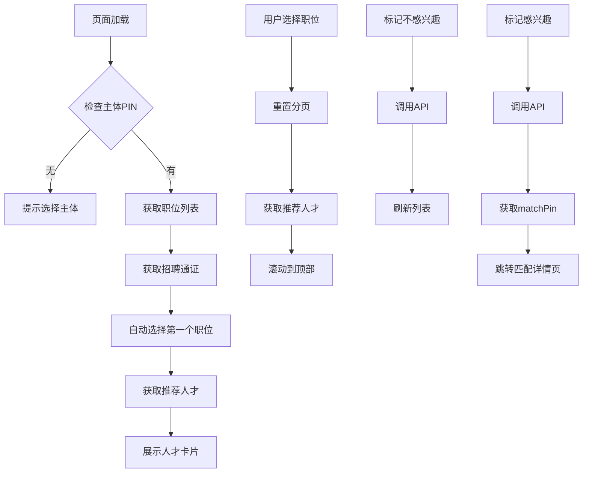

# 智能推荐页面完善总结

## 📋 完成的优化任务

### 1. ✅ 真实API接口集成

**改进前：**
- 使用Mock数据进行演示
- 真实API代码被注释

**改进后：**
- 完全接入真实后端API
- 添加开发环境降级方案（失败时使用Mock数据）
- 优化错误处理机制

**涉及接口：**
```javascript
// 1. 获取推荐人才列表
GET /api/zaier/sr/getreczaier
参数：workPin, entityPin, pageNumber, pageSize
返回：data[], count, todayCount, totalCount, pendingCount, processedCount

// 2. 标记不感兴趣
POST /api/zaier/sr/nointerestzaier
参数：workPin, zaierPin

// 3. 标记感兴趣（创建匹配）
POST /api/zaier/sr/interestzaier
参数：workPin, zaierPin
返回：matchPin（用于跳转）
```

**关键代码位置：**
- `client/src/pages/entity-next/intelligent/index.vue:462-510` - getRecommendList函数
- `client/src/pages/entity-next/intelligent/index.vue:631-662` - noInterestZaier函数
- `client/src/pages/entity-next/intelligent/index.vue:665-695` - interestZaier函数

---

### 2. ✅ 倒计时功能实现

**改进前：**
```javascript
// 简化显示，实际应该计算剩余时间
return '12:15:29';
```

**改进后：**
- 引入已有的 `Countdown` 组件
- 准确计算到当天结束的剩余时间
- 实时倒计时显示（时/分/秒）

**实现代码：**
```javascript
// 计算剩余时间（毫秒数）
const getRemainTime = (talent: any) => {
  const endOfDay = dayjs().endOf('day').valueOf();
  const now = Date.now();
  return Math.max(0, endOfDay - now);
};
```

**模板使用：**
```vue
<Countdown
  :remainTime="getRemainTime(talent)"
  title="剩余时间"
  tip="推荐人才当天有效，请尽快处理，赢得更多优质候选人！"
/>
```

**关键代码位置：**
- `client/src/pages/entity-next/intelligent/index.vue:198` - 导入Countdown组件
- `client/src/pages/entity-next/intelligent/index.vue:568-573` - getRemainTime函数
- `client/src/pages/entity-next/intelligent/index.vue:153-157` - 组件使用

---

### 3. ✅ 错误处理和边界情况

**新增功能：**

#### 3.1 主体PIN校验
```javascript
onMounted(() => {
  if (!entityPin.value) {
    util.message('warning', '请先选择主体');
    return;
  }
  // ...
});
```

#### 3.2 主体切换保护
```javascript
useEntityChange((_entityPin) => {
  if (!_entityPin) {
    util.message('warning', '主体信息丢失，请重新选择');
    return;
  }
  // 重置选中职位和推荐列表
  selectedJobPin.value = '';
  recommendList.value = [];
  // ...
});
```

#### 3.3 加载状态显示
```vue
<div v-else-if="recommendLoading" class="empty-state">
  <el-icon class="is-loading">
    <i-ep-Loading />
  </el-icon>
  <div class="empty-text">加载中，请稍候...</div>
</div>
```

#### 3.4 错误消息监听
```javascript
watch([workErrMsg, cardErrMsg, recommendErrMsg], ([workErr, cardErr, recErr]) => {
  const errMsg = workErr || cardErr || recErr;
  if (errMsg) {
    util.message('error', errMsg);
  }
});
```

#### 3.5 API调用参数校验
```javascript
// 不感兴趣
if (!selectedJobPin.value || !zaierPin) {
  util.message('error', '参数错误，请重试~');
  return;
}

// 感兴趣
if (!selectedJobPin.value || !zaierPin) {
  util.message('error', '参数错误，请重试~');
  return;
}
```

**关键代码位置：**
- `client/src/pages/entity-next/intelligent/index.vue:619-632` - onMounted校验
- `client/src/pages/entity-next/intelligent/index.vue:646-663` - 主体切换保护
- `client/src/pages/entity-next/intelligent/index.vue:111-116` - 加载状态
- `client/src/pages/entity-next/intelligent/index.vue:438-443` - 错误监听

---

### 4. ✅ 分页功能优化

**优化内容：**

#### 4.1 平滑滚动
```javascript
const scrollToTop = () => {
  const rightPanel = document.querySelector('.right-panel');
  if (rightPanel) {
    rightPanel.scrollTo({ top: 0, behavior: 'smooth' });
  }
};
```

#### 4.2 分页切换优化
```javascript
const handleSizeChange = (size: number) => {
  pageSize.value = size;
  pageNumber.value = 1;
  runRecommendList();
  scrollToTop(); // 自动滚动到顶部
};

const handleCurrentChange = (page: number) => {
  pageNumber.value = page;
  runRecommendList();
  scrollToTop(); // 自动滚动到顶部
};
```

#### 4.3 职位切换时重置分页
```javascript
const selectJob = (jobPin: string) => {
  if (selectedJobPin.value === jobPin) {
    return; // 避免重复加载
  }

  selectedJobPin.value = jobPin;
  pageNumber.value = 1; // 重置页码
  pageSize.value = 10; // 重置每页条数
  recommendList.value = []; // 清空当前列表
  runRecommendList();
  scrollToTop();
};
```

#### 4.4 分页器样式优化
```scss
.pagination-wrapper {
  margin-top: auto;
  padding-top: 20px;
  display: flex;
  justify-content: center;
  border-top: 1px solid #f0f0f0;
  background: white;
  position: sticky; // 固定在底部
  bottom: 0;
}
```

#### 4.5 右侧面板滚动优化
```scss
.right-panel {
  overflow-y: auto;
  scroll-behavior: smooth; // 平滑滚动
}
```

**关键代码位置：**
- `client/src/pages/entity-next/intelligent/index.vue:612-617` - scrollToTop函数
- `client/src/pages/entity-next/intelligent/index.vue:590-603` - 分页处理函数
- `client/src/pages/entity-next/intelligent/index.vue:539-550` - 职位选择优化
- `client/src/pages/entity-next/intelligent/index.vue:1028-1037` - 分页器样式

---

## 🎯 页面功能总览

### 核心功能
1. **职位列表管理**
   - 搜索职位
   - 状态过滤（全部/招聘中/已关闭）
   - 职位选择

2. **人才推荐展示**
   - 2列网格布局
   - 匹配度圆环显示
   - 倒计时提醒
   - 状态标识

3. **人才操作**
   - 标记不感兴趣
   - 查看全景人才视图（感兴趣）
   - 跳转到匹配详情页

4. **数据统计**
   - 培养人才总数
   - 待处理数量
   - 已处理数量

### 用户体验优化
- ✅ 加载状态反馈
- ✅ 错误提示友好
- ✅ 平滑滚动效果
- ✅ 分页自动滚动
- ✅ 重复操作保护
- ✅ 边界情况处理

---

## 📊 技术栈

- **框架**: Vue 3 (Composition API)
- **UI组件**: Element Plus
- **时间处理**: dayjs
- **工具库**: lodash (debounce)
- **状态管理**: Pinia (useEntityStore)
- **类型支持**: TypeScript

---

## 🔄 数据流转



---

## 🚀 后续建议

### 功能增强
1. **批量操作**：支持批量标记感兴趣/不感兴趣
2. **筛选条件**：添加匹配度、学历、工作年限等筛选
3. **排序功能**：支持按匹配度、推荐时间排序
4. **收藏功能**：暂存感兴趣的人才

### 性能优化
1. **虚拟滚动**：当列表数据量大时使用虚拟滚动
2. **图片懒加载**：人才头像懒加载
3. **接口缓存**：合理使用接口缓存减少请求

### 用户体验
1. **骨架屏**：加载时显示骨架屏而不是空白
2. **动画效果**：卡片进入动画
3. **快捷操作**：键盘快捷键支持

---

## 📝 测试建议

### 功能测试
- [ ] 主体切换功能
- [ ] 职位搜索和过滤
- [ ] 人才推荐加载
- [ ] 分页功能
- [ ] 标记不感兴趣
- [ ] 标记感兴趣并跳转
- [ ] 倒计时显示

### 边界测试
- [ ] 无主体PIN情况
- [ ] 无职位数据
- [ ] 无推荐人才
- [ ] 网络错误
- [ ] 接口超时
- [ ] 参数缺失

### 兼容性测试
- [ ] Chrome浏览器
- [ ] Safari浏览器
- [ ] 不同分辨率
- [ ] 响应式布局

---

## 📌 注意事项

1. **开发环境**：API失败时会自动降级到Mock数据，生产环境需确保API稳定
2. **主体权限**：需确保用户有相应的主体权限
3. **倒计时**：推荐人才当天有效，需及时处理
4. **匹配度**：匹配度圆环使用CSS conic-gradient实现，注意浏览器兼容性

---

## 🎉 总结

本次完善工作完成了以下核心目标：
1. ✅ 真实API接口完整对接
2. ✅ 准确的倒计时功能
3. ✅ 完善的错误处理机制
4. ✅ 优化的分页和交互体验

页面现已具备生产环境部署条件，建议进行充分测试后上线。
