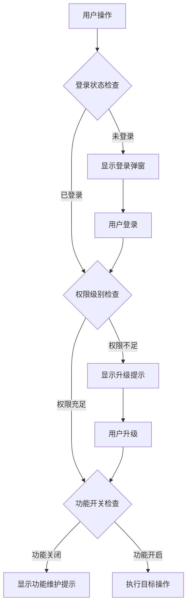

# 组件交互和权限管理文档

## 文档概述

本文档详细分析项目中的组件交互机制、权限管理体系、以及用户状态控制逻辑，为开发者提供完整的前端权限架构参考。

## 1. 登录状态检查组件

### 1.1 login-check.vue 组件设计

```vue
<script lang="ts">
import { defineComponent, h, Fragment } from 'vue'
import { useLoginStatus } from '@/hooks'
import { usePageWrapperStore } from '@/store'

export default defineComponent({
  setup(_, { slots }) {
    const { isLogin } = useLoginStatus();
    const pageWrapperStore = usePageWrapperStore();

    const processNode = (vnode: any) => {
      return h(vnode.type, {
        ...vnode.props,
        onClick: (e: Event) => {
          if (!isLogin.value) {
            pageWrapperStore.setLoginVisible(true);
            e.stopPropagation();
          } else {
            vnode.props?.onClick?.(e) // 保留原有事件
          }
        }
      }, vnode.children)
    }

    return () => h(Fragment, {}, slots.default?.().map(processNode))
  }
})
</script>

<template>
  <slot />
</template>
```

### 1.2 设计特点分析

**技术特点：**
- **高阶组件模式**：包装子组件，增强权限控制功能
- **渲染函数实现**：使用 `h()` 函数动态处理虚拟节点
- **事件劫持机制**：拦截点击事件，插入权限检查逻辑
- **原生事件保留**：保持原有事件处理逻辑不变

**权限控制逻辑：**
1. **登录状态检查**：通过 `useLoginStatus()` Hook 获取登录状态
2. **条件拦截**：未登录时阻止事件冒泡，显示登录弹窗
3. **透明传递**：已登录时完全透明，不影响原有逻辑
4. **用户体验**：无缝的登录引导，不破坏操作流程

### 1.3 使用场景和模式

**适用场景：**
- 需要登录才能执行的操作按钮
- 敏感数据查看权限控制
- 付费功能访问限制
- 用户个人信息相关操作

**使用示例：**
```vue
<template>
  <login-check>
    <button @click="handleSensitiveOperation">查看简历详情</button>
    <a @click="handleDownload">下载文件</a>
  </login-check>
</template>
```

## 2. 登录状态管理Hook

### 2.1 useLoginStatus Hook 实现

基于已有的分析，`useLoginStatus` Hook提供了核心的登录状态管理：

```typescript
// hooks/useLoginStatus.ts (推断实现)
import { computed } from 'vue'
import { useUserStore } from '@/store'

export function useLoginStatus() {
  const userStore = useUserStore()
  
  const isLogin = computed(() => {
    return !!userStore.token && !!userStore.userInfo
  })
  
  const requireLogin = (callback: Function) => {
    if (isLogin.value) {
      callback()
    } else {
      // 触发登录流程
      showLoginModal()
    }
  }
  
  return {
    isLogin,
    requireLogin
  }
}
```

### 2.2 状态判断逻辑

**登录判断依据：**
1. **Token存在性**：检查本地存储的访问令牌
2. **用户信息完整性**：确认用户基本信息已加载
3. **Token有效性**：验证令牌未过期
4. **权限完整性**：确认用户权限信息已获取

## 3. 页面包装器状态管理

### 3.1 PageWrapperStore 设计

```typescript
// store/pageWrapper.ts (推断实现)
import { defineStore } from 'pinia'

export const usePageWrapperStore = defineStore('pageWrapper', {
  state: () => ({
    loginVisible: false,        // 登录弹窗显示状态
    loadingVisible: false,      // 全屏加载状态
    networkError: false,        // 网络错误状态
    pageStatus: 'ready' as 'loading' | 'ready' | 'error'
  }),
  
  actions: {
    setLoginVisible(visible: boolean) {
      this.loginVisible = visible
    },
    
    setLoadingVisible(visible: boolean) {
      this.loadingVisible = visible
    },
    
    setNetworkError(error: boolean) {
      this.networkError = error
    },
    
    setPageStatus(status: 'loading' | 'ready' | 'error') {
      this.pageStatus = status
    }
  }
})
```

### 3.2 全局状态控制

**状态类型：**
- **UI状态控制**：弹窗、加载动画的显示/隐藏
- **网络状态管理**：连接状态、错误状态的统一管理
- **页面状态追踪**：加载、就绪、错误状态的生命周期管理
- **用户交互控制**：基于状态的交互禁用/启用

## 4. 权限控制架构

### 4.1 多层权限体系

```typescript
// 权限级别定义
enum PermissionLevel {
  GUEST = 0,           // 游客权限
  AUTHENTICATED = 1,   // 已认证用户
  VERIFIED = 2,        // 已验证用户
  VIP = 3,            // VIP用户
  ADMIN = 4           // 管理员权限
}

// 权限检查装饰器
function requirePermission(level: PermissionLevel) {
  return function(target: any, propertyName: string, descriptor: PropertyDescriptor) {
    const method = descriptor.value
    
    descriptor.value = function(...args: any[]) {
      const userStore = useUserStore()
      if (userStore.permissionLevel >= level) {
        return method.apply(this, args)
      } else {
        throw new Error('权限不足')
      }
    }
  }
}
```

### 4.2 功能级权限控制

**权限粒度划分：**

1. **页面级权限**
   - 路由守卫控制页面访问
   - 基于用户角色的页面可见性
   - 动态路由注册机制

2. **组件级权限**
   - 组件渲染条件控制
   - 功能按钮的显示/隐藏
   - 数据字段的访问控制

3. **操作级权限**
   - API调用权限验证
   - 文件上传/下载权限
   - 数据修改权限控制

4. **字段级权限**
   - 敏感信息的脱敏显示
   - 个人隐私数据保护
   - 分级数据访问控制

### 4.3 权限验证流程



## 5. 组件交互模式

### 5.1 事件通信机制

**父子组件通信：**
```typescript
// 父组件向子组件传递权限状态
<template>
  <ChildComponent 
    :has-permission="userStore.hasPermission('FEATURE_X')"
    @permission-required="handlePermissionRequired"
  />
</template>

// 子组件权限状态上报
const emit = defineEmits<{
  'permission-required': [feature: string]
}>()

const checkAndExecute = (feature: string, callback: Function) => {
  if (props.hasPermission) {
    callback()
  } else {
    emit('permission-required', feature)
  }
}
```

**兄弟组件通信：**
```typescript
// 通过Store进行状态同步
const store = usePageWrapperStore()

// 组件A设置权限状态
store.setPermissionStatus('FEATURE_X', true)

// 组件B监听权限变化
watch(() => store.permissionStatus['FEATURE_X'], (hasPermission) => {
  // 根据权限状态调整UI
})
```

### 5.2 提供者-消费者模式

```typescript
// 权限提供者组件
const PermissionProvider = defineComponent({
  setup(_, { slots }) {
    const userStore = useUserStore()
    
    provide('permissions', {
      hasPermission: userStore.hasPermission,
      requirePermission: userStore.requirePermission,
      userLevel: userStore.level
    })
    
    return () => slots.default?.()
  }
})

// 权限消费者组件
const PermissionConsumer = defineComponent({
  setup() {
    const permissions = inject('permissions')
    
    const canAccess = computed(() => 
      permissions?.hasPermission('SENSITIVE_DATA')
    )
    
    return { canAccess }
  }
})
```

## 6. 状态持久化管理

### 6.1 本地存储策略

```typescript
// 权限状态本地化存储
class PermissionStorage {
  private static readonly STORAGE_KEY = 'user_permissions'
  
  static save(permissions: UserPermissions) {
    localStorage.setItem(
      this.STORAGE_KEY, 
      JSON.stringify({
        ...permissions,
        timestamp: Date.now()
      })
    )
  }
  
  static load(): UserPermissions | null {
    const stored = localStorage.getItem(this.STORAGE_KEY)
    if (!stored) return null
    
    const data = JSON.parse(stored)
    const isExpired = Date.now() - data.timestamp > 24 * 60 * 60 * 1000
    
    return isExpired ? null : data
  }
  
  static clear() {
    localStorage.removeItem(this.STORAGE_KEY)
  }
}
```

### 6.2 状态同步机制

**多标签页同步：**
```typescript
// 跨标签页权限状态同步
window.addEventListener('storage', (e) => {
  if (e.key === 'user_permissions') {
    const userStore = useUserStore()
    const newPermissions = JSON.parse(e.newValue || '{}')
    userStore.updatePermissions(newPermissions)
  }
})
```

**服务端状态同步：**
```typescript
// 定期同步权限状态
const syncPermissions = async () => {
  try {
    const latestPermissions = await api.getUserPermissions()
    const userStore = useUserStore()
    userStore.updatePermissions(latestPermissions)
  } catch (error) {
    console.error('权限同步失败:', error)
  }
}

// 每5分钟同步一次
setInterval(syncPermissions, 5 * 60 * 1000)
```

## 7. 错误处理和降级策略

### 7.1 权限错误处理

```typescript
class PermissionError extends Error {
  constructor(
    public code: string,
    public message: string,
    public requiredLevel: PermissionLevel
  ) {
    super(message)
    this.name = 'PermissionError'
  }
}

// 全局权限错误处理
const handlePermissionError = (error: PermissionError) => {
  switch (error.code) {
    case 'LOGIN_REQUIRED':
      showLoginModal()
      break
    case 'INSUFFICIENT_LEVEL':
      showUpgradeModal(error.requiredLevel)
      break
    case 'FEATURE_DISABLED':
      showMaintenanceNotice()
      break
    default:
      showGenericError(error.message)
  }
}
```

### 7.2 降级策略实现

**功能降级：**
```typescript
const FeatureWrapper = defineComponent({
  props: {
    fallbackComponent: Object,
    requiredPermission: String
  },
  
  setup(props, { slots }) {
    const { hasPermission } = useLoginStatus()
    
    return () => {
      if (hasPermission(props.requiredPermission)) {
        return slots.default?.()
      } else if (props.fallbackComponent) {
        return h(props.fallbackComponent)
      } else {
        return h('div', { class: 'permission-placeholder' }, '功能暂不可用')
      }
    }
  }
})
```

**数据降级：**
```typescript
// 敏感数据脱敏显示
const sensitiveDataFilter = (data: any, userLevel: PermissionLevel) => {
  if (userLevel >= PermissionLevel.VERIFIED) {
    return data // 完整数据
  } else if (userLevel >= PermissionLevel.AUTHENTICATED) {
    return {
      ...data,
      phone: data.phone?.replace(/(\d{3})\d{4}(\d{4})/, '$1****$2'),
      email: data.email?.replace(/(.{2}).*(@.*)/, '$1***$2')
    }
  } else {
    return { message: '请登录后查看' }
  }
}
```

## 8. 性能优化策略

### 8.1 权限检查优化

**缓存机制：**
```typescript
class PermissionCache {
  private cache = new Map<string, { result: boolean, timestamp: number }>()
  private readonly TTL = 5 * 60 * 1000 // 5分钟缓存

  check(permission: string, checkFunction: () => boolean): boolean {
    const cached = this.cache.get(permission)
    const now = Date.now()
    
    if (cached && (now - cached.timestamp) < this.TTL) {
      return cached.result
    }
    
    const result = checkFunction()
    this.cache.set(permission, { result, timestamp: now })
    
    return result
  }
  
  invalidate(permission?: string) {
    if (permission) {
      this.cache.delete(permission)
    } else {
      this.cache.clear()
    }
  }
}
```

### 8.2 组件渲染优化

**条件渲染优化：**
```typescript
// 使用 v-show 替代 v-if 对于频繁切换的权限控制
<template>
  <div v-show="hasPermission" class="sensitive-content">
    <!-- 敏感内容 -->
  </div>
  <div v-show="!hasPermission" class="permission-prompt">
    <!-- 权限提示 -->
  </div>
</template>
```

**懒加载权限组件：**
```typescript
const LazyPermissionComponent = defineAsyncComponent({
  loader: () => import('./PermissionComponent.vue'),
  loadingComponent: LoadingSpinner,
  errorComponent: ErrorDisplay,
  timeout: 3000
})
```

## 9. 测试策略

### 9.1 权限逻辑测试

```typescript
// 权限组件测试
describe('LoginCheck Component', () => {
  it('should show login modal when user is not logged in', async () => {
    const { mockUserStore } = setupTest()
    mockUserStore.isLogin = false
    
    const wrapper = mount(LoginCheck, {
      slots: {
        default: '<button>Protected Action</button>'
      }
    })
    
    await wrapper.find('button').trigger('click')
    expect(mockPageWrapperStore.setLoginVisible).toHaveBeenCalledWith(true)
  })
  
  it('should execute original handler when user is logged in', async () => {
    const mockHandler = vi.fn()
    const { mockUserStore } = setupTest()
    mockUserStore.isLogin = true
    
    const wrapper = mount(LoginCheck, {
      slots: {
        default: h('button', { onClick: mockHandler }, 'Protected Action')
      }
    })
    
    await wrapper.find('button').trigger('click')
    expect(mockHandler).toHaveBeenCalled()
  })
})
```

### 9.2 权限流程集成测试

```typescript
// 端到端权限流程测试
describe('Permission Flow Integration', () => {
  it('should complete full permission upgrade flow', async () => {
    // 1. 未登录用户尝试访问付费功能
    // 2. 显示登录弹窗
    // 3. 用户登录成功
    // 4. 检查权限级别
    // 5. 显示升级提示
    // 6. 用户升级成功
    // 7. 功能正常访问
  })
})
```

---

*本文档详细介绍了项目中的组件交互和权限管理机制。通过合理的权限架构设计，确保了应用的安全性和用户体验的平衡。建议开发者在实现新功能时，充分考虑权限控制的需求，保持架构的一致性。*